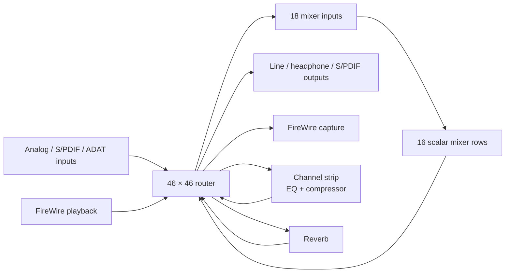
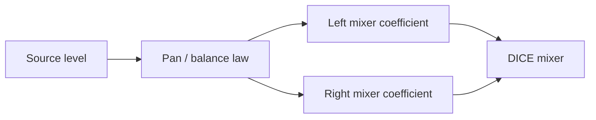
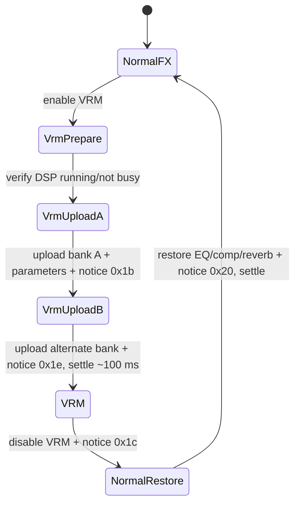

# Focusrite Saffire Pro 24 DSP — Control and DSP Reference

This is the working, device-specific reference for the Focusrite Saffire Pro
24 DSP (`Focusrite 0x00130e`, model `0x000008`).  It records the semantic
model, wire-visible transactions, MixControl behaviour, and implementation
boundaries discovered while bringing the device up in ASFW.

It complements—not replaces—the general audio-semantics documentation and the
DICE stream investigations.  Claims are marked **[measured]** when
observed on this hardware, **[derived]** when recovered from a reference stack
or the vendor binaries and cross-checked, and **[unverified]** when the
behaviour is plausible but still needs a hardware experiment.

## 1. Ground truth and scope

The signal topology and baseline application-section layout are independently
described by ALSA's `snd-firewire-ctl-services` SPro24DSP protocol module:

- `references/alsa-userspace-control-protocols-impl/protocols/dice/src/focusrite/spro24dsp.rs`
- `references/alsa-userspace-control-protocols-impl/runtime/dice/src/focusrite/spro24dsp_model.rs`

The local copy is a behavioral reference only.  It must never be copied into
ASFW: use it to validate addresses, ordering, units, and visible behaviour;
write an independent DriverKit implementation.

The vendor reference is the locally retained `Saffire MixControl` application
and `Saffire.kext`.  Vendor binary analysis supplied the parts ALSA does not
model: natural DSP parameters, stereo-link behaviour, monitor presets,
headphone mirroring, InSitu/VRM choreography, and meter cadence.

ASFW currently has a working DICE stream bring-up and readback-oriented SPro
surface.  This document describes what is safe to expose next; it is not a
claim that every described control is already writable.

### 1.1 Capture limits: absence from a trace is not absence on the wire

Bus captures of this device retain a tiny fraction of traffic. The analyser's
buffer is exhausted long before a session ends, and the flood cannot be filtered
away at capture time: two isochronous audio streams run continuously, and the
vendor driver polls meters throughout, so the interesting control transactions
are a scattering of quadlets inside millions of packets.

A representative session from 2026-08-27 retained **12,659 of 155,202,698
packets — 0.008%**, with a single elided run of 5,695,222 packets and 7 packets
lost outright.

The consequence for every claim in this document: **"it does not appear in the
trace" is a statement about the capture, never about the device.** A transition
that is missing was very probably present on the wire and dropped. Only a
positively observed transaction is evidence, and a `[measured]` tag must rest on
something seen, never on something not seen.

When a specific transition must be captured, shorten the window rather than
filtering the result — quiesce the vendor application's metering if it can be
backgrounded, start the capture immediately before the gesture, and stop it
immediately after. Do not plan a capture that plays back a long session.

## 2. Hardware signal model

At 1x rates the device has a 46×46 router feeding an 18×16 monitor mixer.
The router has physical sources, FireWire playback sources, the sixteen mixer
outputs, channel-strip return, and reverb return.  It also feeds physical,
digital, stream, and mixer-input destinations.



### 2.1 Measured extension address map

Read from this unit on 2026-08-27. The TCAT extension section table sits at
`0xFFFF_E020_0000` (DICE private base `0xFFFF_E000_0000` + extension offset
`0x0020_0000`). It is nine sections of two quadlets, `[offset][size]`, **both
expressed in quadlets — multiply by 4 for bytes**. Offsets below are already in
bytes and are relative to the extension base. **[measured]**

| section | offset | size |
|---|---:|---:|
| caps | `0x00004c` | `0x000010` |
| command | `0x00005c` | `0x000008` |
| mixer | `0x000064` | `0x000484` |
| peak | `0x0004e8` | `0x000200` |
| router | `0x0006e8` | `0x000204` |
| streamFormat | `0x0008ec` | `0x000438` |
| currentConfig | `0x000d24` | `0x006000` |
| standalone | `0x006d24` | `0x000040` |
| application | `0x006d64` | `0x0245f0` |

Caps (`ext+0x4c`, four quadlets) read `00800005 10120225 00011227 00000000`,
decoding to: router exposed, 128 maximum entries; mixer exposed, writable,
**18 inputs × 16 outputs**. **[measured]**

**Mixer cell addressing.** The mixer section opens with one header quadlet
(`0x00000103` on this unit), then a **fixed 16 × 18 window**. The stride is the
*maximum* input count (18), not the device's actual `inputCount`, so a smaller
device does not compact the rows. One quadlet per cell:

```text
cell(out, in) = 0xFFFF_E020_0068 + (out * 18 + in) * 4
```

Worked examples used throughout this document: host playback left is
`cell(0, 14)` = `0xFFFF_E020_00A0`, host playback right is `cell(1, 15)` =
`0xFFFF_E020_00EC`. **[measured]**

**Router entry encoding.** One quadlet per entry, `[peak:16][src:8][dst:8]`,
where each of `src` and `dst` is `[block:4][channel:4]`:

| block | 0 | 1 | 2 | 3 | 4 | 5 | 11 | 12 | 15 |
|---|---|---|---|---|---|---|---|---|---|
| as source | Aes | Adat | Mixer | — | Ins0 | Ins1 | Avs0 | Avs1 | Mute |
| as destination | Aes | Adat | MixerTx0 | MixerTx1 | Ins0 | Ins1 | Avs0 | Avs1 | — |

`Avs` is the FireWire stream block, and its direction flips with its role:
**`Avs0` as a source is host playback, as a destination it is capture.**

The current-config router lives at `currentConfig + 0x0000` (low rate mode),
`+0x2000` (mid) and `+0x4000` (high). The first quadlet is the entry count —
48 on this unit — and the entries follow at `0xFFFF_E020_0D28`. **[measured]**

The first four router entries are reserved for physical-input meter sources:
Mic 1, Mic 2, Line 1, Line 2 in that order.  Preserve them when editing router
images; they are not ordinary patchbay slots. Confirmed on hardware: entries
0–3 carry sources `Ins0:2`, `Ins0:3`, `Ins0:0`, `Ins0:1`, matching the ALSA
`FIXED` specification exactly. **[measured]**

MixControl can present selected mixer outputs as monitor pairs (`MIX 1/2`,
`MIX 3/4`, … `MIX 15/16`). The raw DICE image alone does not prove that every
adjacent pair is one current MixControl bus, or publish its mono/stereo and pan
state. Do not infer this grouping from row adjacency. **[derived]**

## 3. Mixer semantics: why a mono strip is not two faders

The DICE mixer owns two physical coefficients per source and selected stereo
mix destination: left and right.  Those coefficients are the *wire truth* but
not the appropriate primary UI model.

MixControl represents a mono source as one level and one pan control, derives
the left/right coefficients, and supports linking adjacent channel strips.  A
stereo source is represented as linked level plus balance; independent L/R
sends are an advanced/unlinked form.

**Mono pan and stereo balance are not the same curve.** `FFMixerChannel::recalc`
switches on three flags — `bit0 = (field9 == 1)`, `bit1 = (field10 == 1)`,
`bit2 = field1 & 1` — and its cases draw on **two distinct constant sets**:
cases 1/5 use `field7` with constants at `dword_103B70…8C`, while cases 2/6/3/7
use `field8` with `dword_103B98…BC`. ASFW's recovered `BalanceAttenuationDb`
implements the second set only. Cases 3 and 7 are the same code mirrored,
forcing the opposite channel to `-85 dB` — a hard-panned pair, matching the
matrix state measured in §5.1. **[derived]**

**Stereo link is what selects between the two laws** — the pan/balance and the
linked/unlinked readings of the mode flags turned out to be the same distinction.
`FFMix::updateChanCoefs` branches on a per-channel-pair link bitmask at
`+216` of the owning object:

```text
link bit set  -> genLeftChanCoefs(chan & ~1) + genRightChanCoefs(chan | 1)
link bit clear-> genMonoChanCoefs(chan)
```

Three coefficient generators, not one: an unlinked mono channel and a member of
a linked pair are computed by different code with different constants. A second
bitmask at `+220` links *mixes* to each other, matching the one `setMixGain`
consults, so the device model has three tiers of linking. **[derived]**

Which constant set belongs to which generator is still **[unverified]**, and the
constants themselves could not be read from the vendor binary (`get_bytes`
returns zeros at those addresses — not in the loaded segments).

**Do not implement mono pan by reusing the stereo balance law.** Settle it by
readback rather than decompilation: set a mono pan to several known positions in
MixControl, read the resulting cell pairs, and fit. That is capture-independent,
so §1.1's retention problem does not apply, and it keeps the result usable for
an upstream contribution.



The mixer coefficient law is unsigned Q2.14 amplitude:

| coefficient | audible value |
|---:|---:|
| `0x0000` | mute / −∞ dBFS |
| `0x4000` | unity / 0 dB |
| `0xffff` | +12.04 dB |

For a nonzero coefficient, display gain as
`20 × log10(coefficient / 0x4000)`.  Never display it as a percentage.

**The device imposes no ceiling of its own.** A write ladder on an unrouted row
(`Mixer:2` is not a router source, so the probe is inaudible) stored `0x4000`,
`0x8000`, `0xA000`, `0xC000`, `0xE000` and `0xFFFF` verbatim — the full 16-bit
range up to +12.04 dB. Writes wider than 16 bits are masked to the low half
(`0x10000` → `0x0000`, `0x1FFFF` → `0xFFFF`). **[measured]**

A `+6 dB` limit is therefore **host-side UI policy, not hardware**. MixControl's
`FFMixerChannel::recalc` ends by clamping both channels to `[-85.0, +6.0]` dB,
and `-85 dB` is what becomes coefficient `0` at a hard pan stop. ASFW's
`kMaximumLevelMilliDb = 6000` inherits the vendor's choice; it is a decision,
not a constraint. **[derived]**

Two things remain **[unverified]**: that the DSP *applies* gain above unity
rather than saturating — storing a coefficient is not applying it — and what the
summing bus does when several channels sum past full scale.

### 3.1 The matrix is eight stereo mixes, and pan is per-mix

The 18 × 16 matrix is better read as **eight stereo mixes of eighteen sources**.
Rows pair up as `MIX 1/2` … `MIX 15/16` — the same eight tabs MixControl and the
ASFW console present — and within one mix a source's two cells are its *level and
pan in that mix*. The router then decides what each mix pair drives.

On this unit only two of the eight are in use: **rows 0/1 (`MIX 1/2`)** feed every
analog output and S/PDIF out, and **rows 8/9 (`MIX 9/10`)** feed the reverb input
via `Ins0:14/15`. Rows 2–7 and 10–15 are entirely zero. **[measured]**

That reframes the reverb send: it is not a special effect bus, it is monitor mix
9/10 that the *router* happens to point at the reverb. Its per-source levels and
pans work exactly like mix 1/2's.

**A source is therefore panned independently in every mix.** Centring one mix
does not centre another, and that is not a quirk — it is what eight independent
mixes means.

Measured 2026-08-27: centring physical `INPUT 1` took **two writes in two
different mixes**, and the first alone was audibly incomplete —

| step | cell | value | effect |
|---|---|---|---|
| 1 | `cell(1, 0)` @ `0xFFFF_E020_00B0` | `16384` | dry signal centres in `MIX 1/2` |
| 2 | `cell(9, 0)` @ `0xFFFF_E020_02F0` | `8208` | reverb send centres in `MIX 9/10` |

After step 1 the dry voice was centred but its **reverb tail stayed hard left**,
because the mic still reached only the left reverb input. The return (`+5.99 dB`
in both rows 0/1) was faithfully carrying a left-only tail. Nothing was wrong
with the return; the *send* was mono. Step 2 centred the tail. **[measured]**

The reverb consequently has effectively **independent L/R paths** — feeding one
input yields a tail on that side only. **[measured]**

**One cell per source is a configuration, not a constraint.** In the same image,
`ADAT 1`–`ADAT 8` already feed *both* reverb sends at −10.55 dB while mic, line,
S/PDIF and DAW sources are hard-panned. Eight sources demonstrate the matrix
holding a source in both cells of a pair. **[measured]**

**Scope of a pan gesture: one source within one mix.** The vendor's own API
settles it — `FFMixer::setChanGain(mixIndex, chanIndex, gain)` resolves the mix
first (`FFMixer::getMix`) and then delegates to `FFMix::setChanGain(chan, gain)`
on that mix alone. Level and pan live on the per-mix `FFMixerChannel`, so a
channel pan never reaches another mix, and never drags the reverb send with it.
The console's mix selector already chooses the scope. **[derived]**

### Required semantic projection

`AudioSemanticMatrixAxis` publishes stable presentation group and channel role
metadata, so source channels are identified as mono or as a verified stereo
member. Verified stereo pairs are now **writable** as one level-plus-balance
gesture (§3, *Safe mixer write transaction*); mono and unresolved groups remain
read-only readback, because a mono strip still needs its pan law and the monitor
bus still needs its grouping and link state captured.

Pairing is never inferred from row adjacency. A source is paired only when its
signal kind establishes it — host stream, S/PDIF, or the reverb return at
`Ins0:14/15` — which is why the reverb return became writable while numerically
adjacent ADAT channels correctly did not. **[measured]**

**A mono source is two cells, not one.** Every mixer input holds a cell in
*every* monitor row; a mono source simply has no partner input, not a single
coefficient. Reading one row and calling it "the" value is wrong, and on this
device it fails silently for exactly half the sources.

Measured 2026-08-27: the console's mono readback displayed `cell(out0, n)`
only, so **6 of 12 mono strips reported `OFF` while passing signal at +0.0 dB
on the right bus** — MIC 2, LINE 2, ADAT 2, ADAT 4, ADAT 6, ADAT 8. Their
odd-numbered partners rendered correctly only by luck, because the hard-panned
matrix (§5.1) happens to place their cell in row 0. A single-cell projection
works for one parity class and lies about the other. **[measured]**

| mixer input | HW left | HW right | single-cell readout | correct |
|---|---|---|---|---|
| 1 MIC 1 | +0.0 dB | — | `+0.0 dB` | by luck |
| 2 MIC 2 | — | +0.0 dB | `OFF` | **wrong** |
| 3 LINE 1 | +0.0 dB | — | `+0.0 dB` | by luck |
| 4 LINE 2 | — | +0.0 dB | `OFF` | **wrong** |

The general rule: **a projection that reads fewer cells than the semantic object
owns will be right often enough to look correct.** The mono strip now renders
both buses, which also makes the hard-panned structure legible without an
external read — the L/R pair *is* the pan position.

The next matrix revision needs the remaining presentation metadata, not
SPro-specific SwiftUI guesses:

| field | purpose |
|---|---|
| `groupId` | stable stereo/group identity |
| `channelRole` | mono, left, or right |
| `presentation` | mono-pan, stereo-balance, or independent |
| `linkCapable` / `linked` | whether paired mutation is supported/current |
| `panCapable` | permits a pan/balance projection |

Default console projection:

- Mono sources: both bus coefficients as read-only L/R until the pan law is
  captured, then one level fader + pan. Never a single-cell readout. The pan
  applies to the selected mix only — see §3.1.
- Stereo pairs: one linked fader + balance, after link state is read/writable.
- Raw L/R coefficient editing: never exposed as an ordinary console control.
- Mute is a coefficient macro that must remember pre-mute gains.
- Solo is a multi-crosspoint policy, not a separately readable hardware bit.

### Safe mixer write transaction

A bounded raw mixer crosspoint change is a direct 4-byte mixer write followed
by a readback. It does **not** use a router command or a software notice. This
primitive is deliberately **not** exposed through ASFW's semantic control API:
a single cell lacks an audible MixControl meaning. It is retained for protocol
tests and will underpin the grouped transaction below.

```text
read current coefficient / semantic state
  → derive bounded changed coefficient(s)
  → direct 4-byte DICE mixer write per changed crosspoint
  → read back changed coefficient(s)
  → publish a new matrix revision
```

For a linked pair or a pan change, this remains one semantic transaction even
though it changes two crosspoints.  Failure must leave the app tied to hardware
readback, not the requested value.

**Implemented for verified stereo pairs (2026-08-27).** The driver re-reads the
active router alongside the coefficient image before resolving a group, so an
external route change cannot turn a stale group ID into a write against a
different source row. It then issues the two native writes and confirms them by
exact readback. Captured on the wire, one gesture is exactly two `Qwrite`s and
one readback — no router load, no software notice, and no traffic during the
drag itself. Hard-pan stops write a true `0x0000` on the muted side. **[measured]**

## 4. Routing and headphone semantics

Router mutation is a different transaction family from mixer mutation:

```text
read full bounded router image
  → change the requested route(s), preserving meter entries
  → write staged router image
  → execute LoadRouter(active rate mode)
  → poll command completion
  → read current-config router image
  → publish the verified patchbay revision
```

Do not place the patchbay in the monitor-mixer row.  It is an upstream source
assignment layer and belongs in its own expandable console section.

### Headphone mirror

MixControl's headphone link is a routing macro, not a mute mode.  When enabled,
it routes both headphone stereo pairs from the selected monitor output pair.
When disabled, it restores the prior per-headphone routes.  The UI should expose
one explicit `Mirror monitor to headphones` policy control and retain the prior
routes in the driver transaction state. **[derived]**

### Optical mode

Optical S/PDIF versus ADAT is also a routing/configuration change, not a single
boolean.  MixControl updates several low- and high-rate routes, disconnecting
incompatible ADAT or S/PDIF endpoints before applying the new mode.  Rate and
optical controls must therefore rebuild the applicable route image and verify
the result before audio restart.

## 5. Physical I/O and monitor control

The driver currently publishes each physical output pair's source as active
router readback. This is separate from output level/mute and from the mixer.

> **Correction (2026-08-27).** An earlier revision of this section stated, with
> a `[measured]` tag, that all three output pairs resolve to `DAW 1/2` and that
> "changing a raw mixer coefficient cannot affect those paths". **Both halves
> are wrong for the configuration this unit is actually in**, and the second is
> the more damaging: a raw mixer coefficient change is exactly what silenced
> this device. Host playback had been left at −24.8 dB in mixer rows 0/1 and
> there was no audible output; restoring those two cells to unity restored it.
> The claim is retained here rather than deleted, as a caution that a stale
> capture can carry the document's highest-confidence tag.

The measured routing on this unit is that **every analog output pair is fed
from mixer outputs 1/2**, so the monitor mixer is in the path of all of them:

```text
analog out 1 <- Mixer:0     analog out 3 <- Mixer:0     analog out 5 <- Mixer:0
analog out 2 <- Mixer:1     analog out 4 <- Mixer:1     analog out 6 <- Mixer:1
```

S/PDIF out 1/2 (`Aes:6/7`) is also fed from `Mixer:0/1`. **[measured]**

Whether an output pair is mixer-fed or stream-fed is a property of the *active
router image*, not of the device. Read it before reasoning about any output
path; do not assume either topology. **[measured]**

### 5.1 Measured signal fan-out

Physical `INPUT 1` is router source `Ins0:2` — identified by its channel-strip
wiring, since the DSP strips exist to sit on the combo preamp inputs, and
corroborated by the `FIXED` meter ordering in §2.1. It reaches three places:

```text
INPUT 1 (Ins0:2)
  |-> Ins0:8   channel-strip 1 INPUT --[EQ + compressor]--> capture ch 1
  |-> Avs0:14  capture ch 15                                (dry, pre-DSP)
  '-> MixerTx0:0  mixer input 1 -> monitor mix -> every analog output
```

**This is a recording trap.** The host's "Input 1" carries the *processed*
signal; the dry jack arrives on **capture channel 15**. Anyone expecting a clean
take from input 1 gets the hardware EQ and compressor baked in. **[measured]**

The monitor mixer on this unit is **hard-panned**: every mixer input has exactly
one non-zero cell — odd-numbered inputs feed the left bus only, even-numbered
the right only, with no source present in both. A mono source on an odd input is
therefore hard left, which is correct behaviour for a matrix that treats
consecutive inputs as the L and R halves of a stereo pair, and surprising to
anyone expecting a centred mono signal. **[measured]**

Reverb is inside the monitor path, not beside it: mixer rows 8/9 are the reverb
send (`Ins0:14/15` ← `Mixer:8/9`), and the return re-enters as mixer inputs
17/18 via `MixerTx1:0/1`. "Direct monitoring" on this device is consequently
**not dry** whenever the return cells are non-zero. **[measured]**

The currently known writable physical controls are:

| area | control |
|---|---|
| Inputs 1/2 | Line or Instrument mode |
| Line inputs 3/4 and 5/6 | `+16 dBu` or `−10 dBV` nominal level |
| Outputs 1/2, 3/4, 5/6 | individual level and mute |
| Global | mute and dim |

**Two opposite scales share the same numerals — name which one you mean.** The
*stored* byte is attenuation: `0` is 0 dB (full output), rising toward mute. The
out-group words at `0xFFFF_E020_6D70 + 0x08` read `0x00000000` on this unit
while the outputs are at full level, confirming the raw sense. **[measured]**

ALSA and the ASFW console both present the *inverted* value, `vol = 127 − raw`,
so the same full-output state displays as **127**. A document that says "0" and
a UI that says "127" are describing one state, not disagreeing.

That `127` is exactly −127 dB is **[unverified]** — a linear 1 dB/step reading of
the raw byte, not a confirmed law. The console currently states the honest
position, that the calibrated dB law is not published; this document should not
claim more than the UI does.

The output group also carries assignments for hardware knob, mute, and dim
controls.  MixControl exposes monitor presets such as Stereo (1/2), Quad
(1/2 + 5/6), 2.1, 5.1, Mid + Phones 1 (3/4), and Mini + Phones 2 (5/6).  These
are output-assignment macros and should become a later semantic monitor-control
surface; they are not mixer routes. **[derived]**

## 6. Ordinary DSP path

The ordinary DSP path contains two channel strips (EQ + compressor) and a
stereo reverb.  Changes are effective only after the appropriate software notice
is written to application-section offset `0x05ec`.

### 6.1 Channel-strip flags

The flags word is one big-endian `u32` at application offset `0x0078`; notice
`0x05` applies it. With this unit's application section at `0x6d64`, that is
absolute **`0xFFFF_E020_6DDC`** — vendor captures name the absolute address and
this document names the relative one, so always state which. **[measured]**

| bit(s) | meaning | evidence |
|---|---|---|
| 0, 1, 2 | channel 1 EQ enable, compressor enable, EQ-after-compressor | **[measured]** for bits 0–1 |
| 16, 17, 18 | channel 2 equivalent | **[measured]** for bits 16–17 |
| 24 | channel-strip stereo link | **[derived]** — see coverage limits |

Live readback on this unit is `0x00070007`: both strips EQ on, compressor on,
EQ-after-compressor on, link clear. **[measured]**

A vendor capture of four successive toggles pins the codec. These are committed
as a regression fixture in `tests/devices/DiceFocusriteSerializationTests.cpp`:

| value | ch 1 | ch 2 | transition |
|---|---|---|---|
| `0x00070005` | EQ on, comp off | EQ on, comp on | — |
| `0x00050005` | EQ on, comp off | EQ on, comp off | compressor 2 off |
| `0x00050004` | EQ off, comp off | EQ on, comp off | EQ 1 off |
| `0x00040004` | EQ off, comp off | EQ off, comp off | EQ 2 off |

**Coverage limits of that capture.** It demonstrates transitions of bits 0, 1,
16 and 17 only:

- **Compressor 1's off-transition is missing from the capture, not from the
  device.** It is already off in the first retained state. The transition was
  not absent on the wire; it fell outside the retained window (see §1.1). Do not
  read this as evidence about compressor 1's behaviour.
- **Bits 2 and 18 (EQ-after-compressor) hold the same value across all four
  retained states.** Their position is consistent with the ALSA model but no
  retained transition demonstrates it.
- **Bit 24 is clear in all four retained values.** This capture is therefore
  *no evidence at all* for the stereo-link meaning, which rests on vendor
  binary analysis alone. Note this is a statement about the capture, not about
  the bit: nothing here shows bit 24 cannot or did not move.

That last point matters for upstreaming. The **state-destruction bug is provable
without knowing what bit 24 means**: a serializer that starts from zero and
reconstructs only bits 0–2 and 16–18 clears every unmodelled bit, and the live
word above shows unmodelled bits are real. Preserving unknown bits is a
capture-backed, clean-room-safe contribution today. Naming bit 24 as *stereo
link* is not, and needs a capture in which it actually toggles.

All flag mutations must be read-modify-write and must preserve bits outside the
requested field.

When enabling stereo link, MixControl mirrors channel 1's order, EQ state,
compressor state, and coefficients to channel 2 before asserting bit 24.
Disabling link restores independent editing; it does not invent a new DSP state.

### 6.2 Coefficient banks and notices

The device uses rate-specific derived DSP banks.  The vendor's active-rate
bank offsets are:

| rate | bank offset | channel blocks |
|---:|---:|---|
| 44.1 kHz | `0x120` | 0/1 |
| 48 kHz | `0x230` | 2/3 |
| 88.2 kHz | `0x340` | 4/5 |
| 96 kHz | `0x450` | 6/7 |

Within a channel block, the relevant fragments are:

| relative offset | size | role |
|---:|---:|---|
| `0x000` | 6 quadlets | compressor |
| `0x018` | 2 quadlets | EQ output |
| `0x020`, `0x034`, `0x048`, `0x05c` | 5 quadlets each | EQ bands |
| `0x070` | 6 quadlets | reverb |

Use only the affected fragments and then the matching notice:

| effect | notices |
|---|---|
| channel-strip flags | `0x05` |
| compressor, individual channels | `0x06`, `0x07` |
| compressor, paired update | `0x08` |
| EQ output / bands, paired update | `0x0b`, `0x0e`, `0x11`, `0x14`, `0x17` |
| reverb | `0x1a` |

An ordinary DSP mutation is always:

```text
read relevant raw flag word and active-rate bank
  → calculate changed coefficient fragment(s)
  → write only those fragment(s)
  → send exact effect notice(s)
  → read back the flag word / affected coefficients
  → publish a new control revision
```

Never serialize sparse controls into a newly zeroed 0x88-byte block and write
the whole block: EQ, compressor, and reverb occupy overlapping logical regions
of the same rate-specific DSP state.

### 6.3 Friendly parameter laws

The following vendor UI mappings have been recovered and are suitable for a
clean-room implementation and test vectors.

#### Compressor

| UI parameter | range | DSP coefficient mapping |
|---|---:|---|
| Input gain | −18…+18 dB | input stage gain |
| Output gain | −36…+36 dB | `10^(dB / 20)` |
| Threshold | −80…0 dB | `dB / 64` |
| Ratio | vendor ratio control | UI value × `0.5` into coefficient domain |
| Attack | 2…100 ms | `−exp(−1 / (sampleRate × seconds))` |
| Release | 100 ms…3 s | `exp(−1 / (sampleRate × seconds))` |

#### Equalizer

There are low, low-mid, high-mid and high bands, generally with ±18 dB gain.
The centre-frequency ranges are approximately 40 Hz…18 kHz depending on the
band.  Low/mid sections use ordinary boost/cut biquad generation; the high shelf
uses a modelled Neve analogue network followed by a bilinear transform.

The user-facing gain/frequency/Q controls should be stored semantically and
derived for the active sample rate.  Do not expose the five raw biquad numbers
as a primary UI.

#### Reverb

| UI parameter | range | mapping |
|---|---:|---|
| Size | 0…100% | direct |
| Air | 0…100% | stored as `1 − UI value` |
| Mix | 0…100% | wet = `mix²`, dry = `1 − mix²` |
| Prefilter | −5…+5 | nonlinear one-pole coefficient |

## 7. InSitu / VRM is a separate subsystem

InSitu/VRM must not be exposed as an ordinary boolean DSP control.  The vendor
transition:



It writes large coefficient banks, room/position/speaker identifiers, checks
DSP busy/running state, uses notices `0x1b`, `0x1c`, `0x1e`, and `0x20`, and
waits approximately 100 ms during transitions.  The vendor coefficient corpus
also needs a licensing/product decision before ASFW redistributes anything.

Until there is a complete bank/data strategy, expose only read-only VRM status.
The existing boolean-plus-notice helper is insufficient and must not back a UI
toggle.

## 8. Metering

MixControl's GUI idle task runs every 20 ms, i.e. approximately 50 Hz.  It
updates mixer meters on each tick. **[derived]**

ASFW meter policy:

- Metering is explicitly opt-in.
- Read at approximately 50 Hz; UI rendering may coalesce frames but should not
  request a full control/matrix snapshot for each tick.
- Publish compact meter frames with a topology/state revision.
- Gate DSP meter reads on `DSP running && !DSP busy`.
- Publish physical input, playback/output, and available FX meter values with
  source identity so the UI never guesses a lane.
- Preserve the four router meter entries described in §2.

## 9. Current ASFW implementation status and hazards

| area | current state | next action |
|---|---|---|
| DICE streaming / stopped choreography | working on tested hardware | retain regression tests |
| Input and output controls | bounded write + readback exists | display output values as dB attenuation; add monitor assignment semantics |
| Semantic mixer snapshot | verified source grouping; grouped stereo level+balance writes working on hardware, including the reverb **return** pair (mixer inputs 17/18); mono strips render both bus cells | capture the mono pan law — see below — then add the mono level+pan transaction |
| Patchbay | read-only active assignments | implement router-image transaction |
| DSP control surface | readback published | add ordinary DSP transactions only after RMW/fragment path replaces legacy setters |
| VRM | status only | defer until full bank transition is designed |
| Meters | not published as compact telemetry | add opt-in 50 Hz frames |
| Rate/optical | stream/rate logic exists | model as route + config choreography |

In particular, the generic semantic apply entry currently accepts only physical
input and output IDs.  DSP controls must not be made writable by merely
whitelisting their IDs: they need their distinct state/fragment/notice/readback
transaction family.

## 10. Console layout

The SPro UI should use the same single-page, horizontally scrolling console
language as the M-Audio console—not MixControl's old tabs.

```text
┌ Hardware configuration / clock / optical / stream status ────────────────┐
├ Physical inputs ────────────────┬ Physical outputs / monitor assignment ─┤
├ Monitor mixer (readback boundary until grouped semantics are verified) ───┤
│ [mono level+pan strips] [stereo level+balance strips] … horizontal scroll │
├ DSP: channel strip 1 | channel strip 2 | reverb | VRM status ────────────┤
├ Patchbay: source → destination routes, headphone mirror macro ───────────┤
└ Telemetry: opt-in metering, rate, DSP/state status ──────────────────────┘
```

The mixer, DSP and patchbay are distinct rows because they alter different
hardware layers and have different transaction semantics.  Styling primitives
are shared; routing and mixer state are not.

## 11. Implementation order

1. ~~Capture channel role/presentation and grouping for stereo pairs.~~ **Done**
   — presentation group and channel role ship in the matrix. Monitor-bus link
   state and the **mono pan law** are still uncaptured; do not project raw
   scalar rows into mono strips before then.
2. ~~Implement bounded grouped level/balance writes with readback.~~ **Done**
   for verified stereo pairs and hardware-confirmed. Still outstanding: mono
   level+pan, and linked stereo semantic mutations.
3. Replace sparse whole-block DSP setters with active-rate, fragment-based
   RMW transactions.  Implement channel-strip stereo link, EQ/compressor
   enable/order, natural compressor parameters, natural reverb parameters,
   then EQ.
4. Add compact opt-in meters at ~50 Hz.
5. Add verified patchbay writes and the headphone-mirror macro.
6. Add monitor assignment presets, then rate/clock/optical configuration
   choreography.
7. Design VRM separately, including coefficient-data licensing and hardware
   validation.

Every writable item is gated by hardware readback.  A UI state is not current
until the device confirms it.

## 12. Linux / ALSA contribution candidates

The useful upstream work is clean-room protocol behaviour and tests, not a
copy of vendor code:

1. Fix the current SPro24DSP reverb write loop: it creates a `0x88`-byte buffer
   but iterates through `0x110` bytes, producing an out-of-bounds slice.
2. Preserve and expose channel-strip stereo-link bit 24.
3. Add documented friendly compressor controls (dB, ratio, ms/s) instead of
   only raw coefficients.
4. Resolve the existing friendly-EQ conversion TODO with independently written
   coefficient generation and test vectors.
5. Add friendly reverb prefilter semantics.
6. Consider FX metering and an explicit headphone-monitor mirror policy.
7. Defer VRM until its alternate banks and coefficient-data provenance are
   settled.

The upstream reference currently models only the per-channel EQ/compressor
flags and raw coefficient-domain controls.  It does not represent the vendor
stereo link, monitor macro semantics, or full VRM transition.

## 13. Hardware validation checklist

- Confirm mono source level/pan produces the expected left/right Q2.14 pair.
- Confirm linked stereo change mirrors the companion DSP and mixer state.
- Exercise each DSP control at 44.1, 48, 88.2 and 96 kHz; verify the active
  bank, notice, readback and audible result.
- Toggle optical ADAT/S/PDIF at each applicable rate and verify both route image
  and stream geometry.
- Toggle headphone mirror, then restore and confirm the original routes return.
- Enable/disable meters while audio runs; confirm no control UI latency or bus
  backlog at 50 Hz.
- Verify VRM remains read-only until a complete implementation exists.
