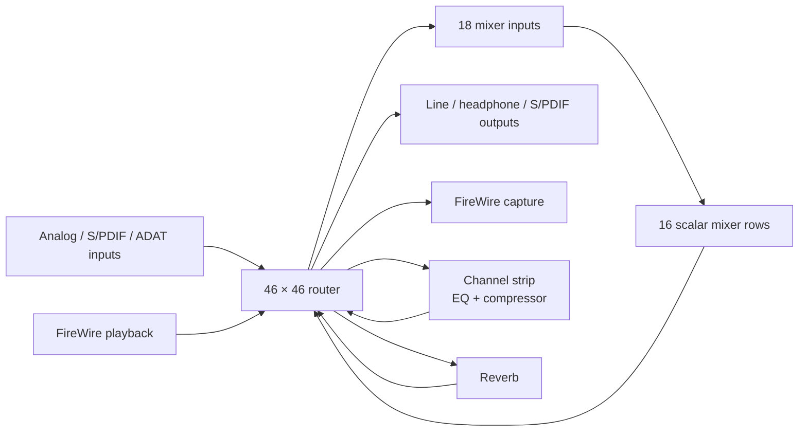
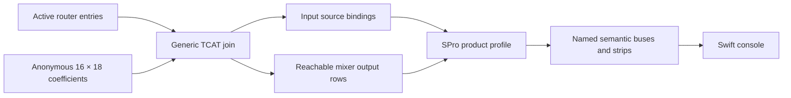
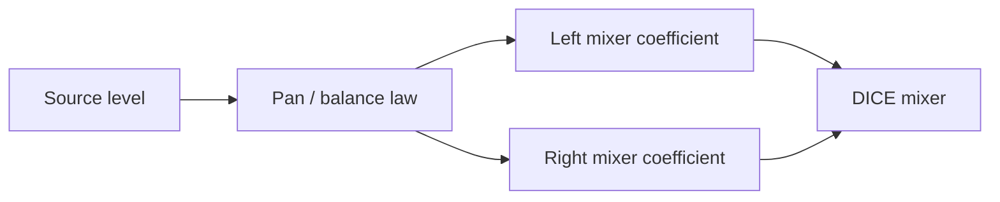
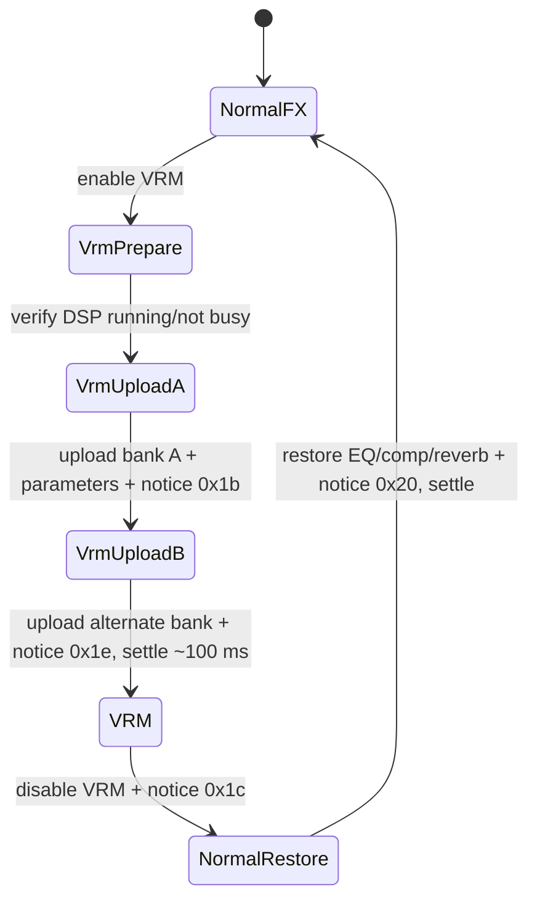

# Focusrite Saffire Pro 24 DSP — Control and DSP Reference

This is the working, device-specific reference for the Focusrite Saffire Pro
24 DSP (`Focusrite 0x00130e`, model `0x000008`).  It records the semantic
model, wire-visible transactions, MixControl behaviour, and implementation
boundaries discovered while bringing the device up in ASFW.

It complements—not replaces—the general audio-semantics documentation and the
DICE stream investigations.  Claims are marked **[measured]** when
observed on this hardware, **[derived]** when recovered from a reference stack
or the vendor binaries and cross-checked, and **[unverified]** when the
behaviour is plausible but still needs a hardware experiment.

## 1. Ground truth and scope

The signal topology and baseline application-section layout are independently
described by ALSA's `snd-firewire-ctl-services` SPro24DSP protocol module:

- `references/alsa-userspace-control-protocols-impl/protocols/dice/src/focusrite/spro24dsp.rs`
- `references/alsa-userspace-control-protocols-impl/runtime/dice/src/focusrite/spro24dsp_model.rs`

The local copy is a behavioral reference only.  It must never be copied into
ASFW: use it to validate addresses, ordering, units, and visible behaviour;
write an independent DriverKit implementation.

The vendor reference is the locally retained `Saffire MixControl` application
and `Saffire.kext`.  Vendor binary analysis supplied the parts ALSA does not
model: natural DSP parameters, stereo-link behaviour, monitor presets,
headphone mirroring, InSitu/VRM choreography, and meter cadence.

ASFW currently has working DICE stream bring-up, a router-bound SPro mixer
projection, and bounded grouped writes for verified mono and stereo strips. This
document describes what is safe to expose next; it is not a claim that every
described control is already writable.

### 1.1 Capture limits: absence from a trace is not absence on the wire

Bus captures of this device retain a tiny fraction of traffic. The analyser's
buffer is exhausted long before a session ends, and the flood cannot be filtered
away at capture time: two isochronous audio streams run continuously, and the
vendor driver polls meters throughout, so the interesting control transactions
are a scattering of quadlets inside millions of packets.

A representative session from 2026-08-27 retained **12,659 of 155,202,698
packets — 0.008%**, with a single elided run of 5,695,222 packets and 7 packets
lost outright.

The consequence for every claim in this document: **"it does not appear in the
trace" is a statement about the capture, never about the device.** A transition
that is missing was very probably present on the wire and dropped. Only a
positively observed transaction is evidence, and a `[measured]` tag must rest on
something seen, never on something not seen.

When a specific transition must be captured, shorten the window rather than
filtering the result — quiesce the vendor application's metering if it can be
backgrounded, start the capture immediately before the gesture, and stop it
immediately after. Do not plan a capture that plays back a long session.

## 2. Hardware signal model

At 1x rates the device has a 46×46 router feeding an 18×16 monitor mixer.
The router has physical sources, FireWire playback sources, the sixteen mixer
outputs, channel-strip return, and reverb return.  It also feeds physical,
digital, stream, and mixer-input destinations.



### 2.1 Measured extension address map

Read from this unit on 2026-08-27. The TCAT extension section table sits at
`0xFFFF_E020_0000` (DICE private base `0xFFFF_E000_0000` + extension offset
`0x0020_0000`). It is nine sections of two quadlets, `[offset][size]`, **both
expressed in quadlets — multiply by 4 for bytes**. Offsets below are already in
bytes and are relative to the extension base. **[measured]**

| section | offset | size |
|---|---:|---:|
| caps | `0x00004c` | `0x000010` |
| command | `0x00005c` | `0x000008` |
| mixer | `0x000064` | `0x000484` |
| peak | `0x0004e8` | `0x000200` |
| router | `0x0006e8` | `0x000204` |
| streamFormat | `0x0008ec` | `0x000438` |
| currentConfig | `0x000d24` | `0x006000` |
| standalone | `0x006d24` | `0x000040` |
| application | `0x006d64` | `0x0245f0` |

Caps (`ext+0x4c`, four quadlets) read `00800005 10120225 00011227 00000000`,
decoding to: router exposed, 128 maximum entries; mixer exposed, writable,
**18 inputs × 16 outputs**. **[measured]**

**Mixer cell addressing.** The mixer section opens with one header quadlet
(`0x00000103` on this unit), then a **fixed 16 × 18 window**. The stride is the
*maximum* input count (18), not the device's actual `inputCount`, so a smaller
device does not compact the rows. One quadlet per cell:

```text
cell(out, in) = 0xFFFF_E020_0068 + (out * 18 + in) * 4
```

Worked examples used throughout this document: host playback left is
`cell(0, 14)` = `0xFFFF_E020_00A0`, host playback right is `cell(1, 15)` =
`0xFFFF_E020_00EC`. **[measured]**

**Router entry encoding.** One quadlet per entry, `[peak:16][src:8][dst:8]`,
where each of `src` and `dst` is `[block:4][channel:4]`:

| block | 0 | 1 | 2 | 3 | 4 | 5 | 11 | 12 | 15 |
|---|---|---|---|---|---|---|---|---|---|
| as source | Aes | Adat | Mixer | — | Ins0 | Ins1 | Avs0 | Avs1 | Mute |
| as destination | Aes | Adat | MixerTx0 | MixerTx1 | Ins0 | Ins1 | Avs0 | Avs1 | — |

`Avs` is the FireWire stream block, and its direction flips with its role:
**`Avs0` as a source is host playback, as a destination it is capture.**

The current-config router lives at `currentConfig + 0x0000` (low rate mode),
`+0x2000` (mid) and `+0x4000` (high). The first quadlet is the entry count —
48 on this unit — and the entries follow at `0xFFFF_E020_0D28`. **[measured]**

The first four router entries are reserved for physical-input meter sources:
Mic 1, Mic 2, Line 1, Line 2 in that order.  Preserve them when editing router
images; they are not ordinary patchbay slots. Confirmed on hardware: entries
0–3 carry sources `Ins0:2`, `Ins0:3`, `Ins0:0`, `Ins0:1`, matching the ALSA
`FIXED` specification exactly. **[measured]**

MixControl can present selected mixer outputs as monitor pairs (`MIX 1/2`,
`MIX 3/4`, … `MIX 15/16`). The raw DICE image alone does not prove that every
adjacent pair is one current MixControl bus, or publish its mono/stereo and pan
state. Do not infer this grouping from row adjacency. **[derived]**

### 2.2 Generic TCAT router/mixer topology boundary

The TCAT mixer section is an **anonymous scalar coefficient matrix**. It has no
channel names, physical-output assignment, stereo grouping, pan law, or product
meaning. Those facts cannot be reconstructed from the coefficient image alone.
The active router supplies the protocol-level identity and reachability:

- a route whose destination is `MixerTx0:n` binds source identity to mixer
  input `n` (`0...15`);
- a route whose destination is `MixerTx1:n` binds source identity to mixer
  input `16 + n` (`16...17` on TCD22xx);
- a route whose source is `Mixer:n` proves that mixer output row `n` currently
  reaches at least one router destination;
- a mixer row with no active router consumer is computed storage, not an
  active hardware bus, and must not become a UI tab merely because it exists.

This join is generic TCAT/TCD22xx behaviour, not Focusrite behaviour. It was
cross-checked independently against the local ALSA control reference:

- `tcat/extension/router_entry.rs`: `MixerTx0`, `MixerTx1`, and `Mixer` block
  identifiers;
- `tcat/tcd22xx_spec.rs`: sixteen `MixerTx0` inputs plus two `MixerTx1` inputs;
- `tcat/extension/mixer_section.rs`: fixed 16×18 row-major window and plain
  per-quadlet coefficient writes.

ASFW implements the join in
`ASFWDriver/Audio/Protocols/DICE/Core/DICERouterMixerTopology.{hpp,cpp}`. The
generic result deliberately contains only:

```text
inputCount / outputCount
input[i] = { routed, complete active-router entry }
outputRouteCounts[row] = number of active consumers of Mixer:row
```

It contains no SPro labels or stereo assumptions. Invalid geometry fails
closed, and two routes targeting the same mixer input also fail closed because
they make that input's source identity ambiguous. **[implemented]**



For the captured SPro24DSP router image, this boundary produces exactly four
published scalar rows after the product profile is applied:

| raw mixer row | active SPro role | semantic presentation |
|---:|---|---|
| 0 | consumed monitor output | `MIX 1/2` left |
| 1 | consumed monitor output | `MIX 1/2` right |
| 8 | consumed reverb input | `REVERB SEND` left |
| 9 | consumed reverb input | `REVERB SEND` right |
| 2–7, 10–15 | no active router consumer | unpublished |

The product profile in `SPro24DspSemanticMatrix.cpp` assigns rows 0–7 the
potential role `MonitorMix`, rows 8–9 `EffectSend`, and rows 10–15 no SPro
role; the generic reachability test then removes inactive rows. Thus this
particular state publishes 0/1 and 8/9 without claiming that every TCAT device
uses those meanings. **[measured, implemented]**

**Native row identity must survive semantic compaction.** A dense semantic
snapshot numbers the four published rows `0...3`, but semantic rows 2/3 still
refer to native hardware rows 8/9. Stable output port IDs encode the native row,
and every grouped write resolves that port ID back to the raw output before
touching a coefficient. Using the compact semantic index as a hardware index
would silently redirect a reverb-send write to inactive rows 2/3. A regression
test fixes this boundary by asserting that compact semantic row 2 reads the
fixture's raw row-8 coefficient. **[implemented]**

## 3. Mixer semantics: why a mono strip is not two faders

The DICE mixer owns two physical coefficients per source and selected stereo
mix destination: left and right.  Those coefficients are the *wire truth* but
not the appropriate primary UI model.

MixControl represents a mono source as one level and one pan control, derives
the left/right coefficients, and supports linking adjacent channel strips.  A
stereo source is represented as linked level plus balance; independent L/R
sends are an advanced/unlinked form.

**Mono pan and stereo balance are not the same curve.** `FFMixerChannel::recalc`
switches on three flags — `bit0 = (field9 == 1)`, `bit1 = (field10 == 1)`,
`bit2 = field1 & 1` — and its cases draw on **two distinct constant sets**:
cases 1/5 use `field7` with constants at `dword_103B70…8C`, while cases 2/6/3/7
use `field8` with `dword_103B98…BC`. ASFW's recovered `BalanceAttenuationDb`
implements the second set only. Cases 3 and 7 are the same code mirrored,
forcing the opposite channel to `-85 dB` — a hard-panned pair, matching the
matrix state measured in §5.1. **[derived]**

**Stereo link is what selects between the two laws** — the pan/balance and the
linked/unlinked readings of the mode flags turned out to be the same distinction.
`FFMix::updateChanCoefs` branches on a per-channel-pair link bitmask at
`+216` of the owning object:

```text
link bit set  -> genLeftChanCoefs(chan & ~1) + genRightChanCoefs(chan | 1)
link bit clear-> genMonoChanCoefs(chan)
```

Three coefficient generators, not one: an unlinked mono channel and a member of
a linked pair are computed by different code with different constants. A second
bitmask at `+220` links *mixes* to each other, matching the one `setMixGain`
consults, so the device model has three tiers of linking. **[derived]**

Which constant set belongs to which generator is still **[unverified]**, and the
constants themselves could not be read from the vendor binary (`get_bytes`
returns zeros at those addresses — not in the loaded segments).

**Do not implement mono pan by reusing the stereo balance law.** Settle it by
readback rather than decompilation: set a mono pan to several known positions in
MixControl, read the resulting cell pairs, and fit. That is capture-independent,
so §1.1's retention problem does not apply, and it keeps the result usable for
an upstream contribution.



The mixer coefficient law is unsigned Q2.14 amplitude:

| coefficient | audible value |
|---:|---:|
| `0x0000` | mute / −∞ dBFS |
| `0x4000` | unity / 0 dB |
| `0xffff` | +12.04 dB |

For a nonzero coefficient, display gain as
`20 × log10(coefficient / 0x4000)`.  Never display it as a percentage.

**The device imposes no ceiling of its own.** A write ladder on an unrouted row
(`Mixer:2` is not a router source, so the probe is inaudible) stored `0x4000`,
`0x8000`, `0xA000`, `0xC000`, `0xE000` and `0xFFFF` verbatim — the full 16-bit
range up to +12.04 dB. Writes wider than 16 bits are masked to the low half
(`0x10000` → `0x0000`, `0x1FFFF` → `0xFFFF`). **[measured]**

A `+6 dB` limit is therefore **host-side UI policy, not hardware**. MixControl's
`FFMixerChannel::recalc` ends by clamping both channels to `[-85.0, +6.0]` dB,
and `-85 dB` is what becomes coefficient `0` at a hard pan stop. ASFW's
`kMaximumLevelMilliDb = 6000` inherits the vendor's choice; it is a decision,
not a constraint. **[derived]**

Two things remain **[unverified]**: that the DSP *applies* gain above unity
rather than saturating — storing a coefficient is not applying it — and what the
summing bus does when several channels sum past full scale.

### 3.1 The matrix has sixteen scalar rows; the SPro profile establishes pairs

At the generic TCAT layer the 18 × 16 matrix is only sixteen scalar output rows
over eighteen scalar inputs. Pairing adjacent rows into a level/pan or
level/balance object is a product convention and must not be inferred from the
matrix geometry. The SPro vendor signal table and measured router state establish
the relevant pairings for this device; the router then decides what each pair
currently drives.

The SPro signal table exposes only `Mixer:0`…`9` as possible router sources —
**four monitor pairs plus one reverb-send pair**. Rows 10–15 are computed and
stored but have no SPro product destination. The active router is narrower
still: it currently consumes only rows 0/1 and 8/9, so rows 2–7 and 10–15 are
not published by the semantic snapshot. See §2.2. **[derived, measured]**

On this unit only two of the five SPro-defined pairs are active: **rows 0/1
(`MIX 1/2`)** feed every analog output and S/PDIF out, and **rows 8/9** feed the
reverb input via `Ins0:14/15`. Rows 2–7 and 10–15 are entirely zero.
**[measured]**

At the TCAT protocol layer the reverb send is not a special coefficient type:
it uses the same scalar mixer rows as a monitor pair. At the SPro product layer
it is nevertheless a dedicated **effect-send bus**, because the router consumes
rows 8/9 exclusively as the reverb input. Its per-source level/pan mechanics are
the same as rows 0/1, while its UI role is deliberately separate.

**A source is therefore panned independently in every mix.** Centring one mix
does not centre another, and that is not a quirk — each SPro output pair owns
independent coefficients.

Measured 2026-08-27: centring physical `INPUT 1` took **two writes in two
different mixes**, and the first alone was audibly incomplete —

| step | cell | value | effect |
|---|---|---|---|
| 1 | `cell(1, 0)` @ `0xFFFF_E020_00B0` | `16384` | dry signal centres in `MIX 1/2` |
| 2 | `cell(9, 0)` @ `0xFFFF_E020_02F0` | `8208` | reverb send centres in `MIX 9/10` |

After step 1 the dry voice was centred but its **reverb tail stayed hard left**,
because the mic still reached only the left reverb input. The return (`+5.99 dB`
in both rows 0/1) was faithfully carrying a left-only tail. Nothing was wrong
with the return; the *send* was mono. Step 2 centred the tail. **[measured]**

The reverb consequently has effectively **independent L/R paths** — feeding one
input yields a tail on that side only. **[measured]**

**One cell per source is a configuration, not a constraint.** In the same image,
`ADAT 1`–`ADAT 8` already feed *both* reverb sends at −10.55 dB while mic, line,
S/PDIF and DAW sources are hard-panned. Eight sources demonstrate the matrix
holding a source in both cells of a pair. **[measured]**

**Scope of a pan gesture: one source within one mix.** The vendor's own API
settles it — `FFMixer::setChanGain(mixIndex, chanIndex, gain)` resolves the mix
first (`FFMixer::getMix`) and then delegates to `FFMix::setChanGain(chan, gain)`
on that mix alone. Level and pan live on the per-mix `FFMixerChannel`, so a
channel pan never reaches another mix, and never drags the reverb send with it.
The console's mix selector already chooses the scope. **[derived]**

### Required semantic projection

`AudioSemanticMatrixAxis` publishes stable presentation group and channel role
metadata, so source channels are identified as mono or as a verified stereo
member. A parallel, driver-owned crosspoint presentation map classifies every
active cell as hidden, scalar readback, mono level+pan, or stereo
level+balance. Swift renders and enables controls from this declaration; it
does not infer product semantics from source count or matrix adjacency.

Pairing is never inferred from row adjacency. A source is paired only when its
signal kind establishes it — host stream, S/PDIF, or the reverb return at
`Ins0:14/15` — which is why the reverb return became writable while numerically
adjacent ADAT channels correctly did not. **[measured]**

**A mono source is two cells, not one.** Every mixer input holds a cell in
*every* monitor row; a mono source simply has no partner input, not a single
coefficient. Reading one row and calling it "the" value is wrong, and on this
device it fails silently for exactly half the sources.

Measured 2026-08-27: the console's mono readback displayed `cell(out0, n)`
only, so **6 of 12 mono strips reported `OFF` while passing signal at +0.0 dB
on the right bus** — MIC 2, LINE 2, ADAT 2, ADAT 4, ADAT 6, ADAT 8. Their
odd-numbered partners rendered correctly only by luck, because the hard-panned
matrix (§5.1) happens to place their cell in row 0. A single-cell projection
works for one parity class and lies about the other. **[measured]**

| mixer input | HW left | HW right | single-cell readout | correct |
|---|---|---|---|---|
| 1 MIC 1 | +0.0 dB | — | `+0.0 dB` | by luck |
| 2 MIC 2 | — | +0.0 dB | `OFF` | **wrong** |
| 3 LINE 1 | +0.0 dB | — | `+0.0 dB` | by luck |
| 4 LINE 2 | — | +0.0 dB | `OFF` | **wrong** |

The general rule: **a projection that reads fewer cells than the semantic object
owns will be right often enough to look correct.** The mono strip now renders
both buses, which also makes the hard-panned structure legible without an
external read — the L/R pair *is* the pan position.

Matrix ABI v6 carries the product presentation metadata which was previously
missing:

| field | purpose |
|---|---|
| `groupId` | stable stereo/group identity |
| `channelRole` | mono, left, or right |
| `crosspointPresentation` | hidden, scalar readback, mono-pan, or stereo-balance |
| `stripStates` | sparse mute/solo records and the level each strip returns to |

Current console projection:

- Mono sources: one level fader + pan when both destination cells are declared
  `MonoLevelPan`; otherwise both bus coefficients remain read-only. The write
  uses an explicitly ASFW-defined equal-power curve: centre is approximately
  −3.0103 dB per side and hard endpoints write an exact zero. This is a safe,
  documented project policy, **not a claim that the unrecovered vendor mono
  curve is identical**. The pan applies to the selected mix only — see §3.1.
- Stereo pairs: one linked fader + balance when both diagonal cells are
  declared `StereoLevelBalance`.
- Reverb return: valid in monitor buses, but hidden from the reverb-send bus so
  the console cannot create an accidental hardware self-feedback loop.
- Raw L/R coefficient editing: never exposed as an ordinary console control.
- Mute and solo: per strip, on the selected bus. See §3.2.

### 3.2 Mute and solo are coefficient policy, not device state

**Neither is a hardware bit.** A mixer coefficient of zero *is* what a mute is on
this device, so "muted at −6 dB" and "faded to silence" are the same cell value
on the wire. The level a strip returns to therefore cannot be read back from the
device at all; it exists only if the driver remembers it. That single fact
decides the whole design. **[derived]**

The driver keeps a **sparse record set** alongside the coefficient image, and
publishes it in the matrix. A strip with no record is neither muted nor soloed,
and its nominal level is simply its live coefficient — which is what makes the
very first mute of a strip reversible without any prior bookkeeping.

```text
suppressed = strip.muted OR (some strip on this bus is soloed AND this one is not)
effective  = suppressed ? 0 : nominal
```

Four consequences worth stating, because each is a way to get this wrong:

- **Explicit mute and solo suppression are stored separately.** If solo merely
  set the mute flag on everything else, clearing the solo would also clear a
  mute the user had set by hand.
- **A solo-suppressed strip still needs a record.** Its live coefficient is
  zero, so without a remembered nominal, clearing the solo would restore
  silence. The records are captured *before* the policy changes, not after.
- **A fader still moves while muted.** A level gesture on a suppressed strip
  updates what the strip returns to and writes nothing audible; it must not
  lift the mute behind the user's back. The console follows the remembered
  nominal rather than the silence on the wire, or muting would destroy the very
  position it has to restore.
- **Hardware wins on conflict.** Anything that writes a coefficient behind the
  driver's back — the vendor application, MCP, another host — can leave a record
  describing a strip that is no longer silent. Those records are dropped when
  the coefficient image is re-read, because a stale one would otherwise
  "restore" a level the user never set. **[implemented]**

Solo is a **multi-crosspoint transaction**: it writes every cell on the bus
whose effective value changes, then confirms *all* of them by readback. A
partially applied solo is a worse state to publish than a failed one. Only
changed cells are written, so an idempotent gesture costs no bus traffic.

**Bound.** The snapshot travels IOKit's inline structure-output path, which caps
at 4096 bytes and — as recorded in §1.1's spirit — fails closed *and silent*
above it. The record set is therefore bounded at 64, and the wire snapshot is
3768 bytes with a `static_assert` pinning it under the ceiling. A gesture that
would need a 65th record is refused rather than partially applied, because a
dropped record is a nominal level nothing could ever restore. Growing this
surface again means moving the read to an out-of-line descriptor first.
**[implemented]**

Mute and solo are device-independent mixer semantics, so the policy lives in
`ASFWDriver/Audio/Shared/Topology/AudioSemanticMatrixStripStates.{hpp,cpp}` and
the SPro profile supplies only the native writes. Another matrix-publishing
profile inherits it.

**Verified on hardware 2026-08-27 by coefficient readback**, not by ear. The
mixer window was read directly over FireWire (`0xFFFFE0200068`, 16 x 18
quadlets) before and after each gesture and diffed cell by cell:

| gesture | measured |
|---|---|
| mute one mono strip | exactly its two cells go to a true `0x0000`; no other cell in the 288 moves; rows 8/9 untouched |
| un-mute | those two cells return to exactly `11585` — the constant-power centre, `16384 x cos(pi/4)` — proving a remembered nominal rather than unity or a re-derivation |
| move the fader while muted, then un-mute | returns at the **new** level (`23/23`, i.e. -54.04 dB centred), not the pre-mute `11585` and not `0` |
| solo one strip | 18 cells written, not 36: the hard-panned strips already held `0` on one side and were skipped. Soloed strip untouched, reverb send untouched |
| clear the solo | **all 288 cells bit-identical to the pre-solo image**, including the -54 dB strip landing back on exactly `23/23` |

The fader-while-muted case is the one no listening test can reach: silence is
silence whichever nominal the driver is holding. The first attempt at it was
inconclusive because the fader was moved to minimum, which produces coefficient
`0` and is therefore indistinguishable from a mute on the wire -- when designing
this check, the level must be non-zero *and* different from the pre-mute one.
**[measured]**

The same readback independently confirmed the vendor signal table (section 5.0):
the live router maps `Ins0:2 -> Anlg In 1` and `Ins0:0 -> Anlg In 3`, so the
rear-pair-is-3/4 correction recovered from `Pro24DSP_IpSigTab` is what the
hardware actually does.

### Safe mixer write transaction

A bounded raw mixer crosspoint change is a direct 4-byte mixer write followed
by a readback. It does **not** use a router command or a software notice. This
primitive is deliberately **not** exposed through ASFW's semantic control API:
a single cell lacks an audible MixControl meaning. It is retained for protocol
tests and will underpin the grouped transaction below.

```text
read current coefficient / semantic state
  → derive bounded changed coefficient(s)
  → direct 4-byte DICE mixer write per changed crosspoint
  → read back changed coefficient(s)
  → publish a new matrix revision
```

For a linked pair or a pan change, this remains one semantic transaction even
though it changes two crosspoints.  Failure must leave the app tied to hardware
readback, not the requested value.

**Implemented for verified mono and stereo strips (2026-08-27).** The driver re-reads the
active router alongside the coefficient image before resolving a group, so an
external route change cannot turn a stale group ID into a write against a
different source row. It then issues the two native writes and confirms them by
exact readback. Captured on the wire, one gesture is exactly two `Qwrite`s and
one readback — no router load, no software notice, and no traffic during the
drag itself. A stereo strip addresses its real left/right source cells; a mono
strip addresses one source cell against both destination rows. Hard-pan stops
write a true `0x0000` on the muted side. The transaction shape and stereo law
are **[measured]**; the mono equal-power law is **[implemented policy]**.

## 4. Routing and headphone semantics

Router mutation is a different transaction family from mixer mutation:

```text
read full bounded router image
  → change the requested route(s), preserving meter entries
  → write staged router image
  → execute LoadRouter(active rate mode)
  → poll command completion
  → read current-config router image
  → publish the verified patchbay revision
```

Do not place the patchbay in the monitor-mixer row.  It is an upstream source
assignment layer and belongs in its own expandable console section.

### 4.1 What the device actually permits, measured

Read live on 2026-08-27 before writing any of this:

| capability | value |
|---|---|
| router `is_exposed` / `is_readonly` / `is_storable` | true / **false** / true |
| router `maximum_entry_count` | 128 (48 in use) |
| mixer `is_readonly` | false |
| general `dynamic_stream_format` / `storage_avail` / `peak_avail` | true / true / true |

So the device permits router writes outright. Two measured facts shape the
transaction beyond the sequence above:

**The staging router section reads back an entry count of zero** while
CURRENT_CONFIG holds 48. An edit therefore cannot be a read-modify-write of the
staging section: the image is built from the active copy, modified, and written
whole. **[measured]**

**Entry position is semantically meaningful.** The peak section is a parallel
array of router entries indexed by position (`peak_section.rs` deserialises it
with the router-entry decoder), so moving an entry moves what a meter reads.
Entries 0-3 carry the physical-input meter sources and entries 46/47 both target
`blk15:0` -- the same destination twice, which is illegal for a route and exists
to give `Mixer:0/1` a metering slot. An editor must therefore retarget sources
**in place** and never add, remove, reorder or compact. `DICERouterImage`
enforces exactly that: it offers in-place source replacement only, refuses the
reserved leading range, and refuses a destination that appears more than once or
not at all. Adding a route is a larger question -- which meter slot it displaces
-- and is deliberately not expressible rather than available and silently wrong.
**[implemented]**

Use `kLoadRouter` (0x01), **not** `kLoadRouterStreamConfig` (0x03): the combined
opcode is what stream bring-up issues and it disturbs the stream image, which a
patchbay edit must not. Command mechanics are cross-validated with the local
ALSA control reference, `tcat/extension/cmd_section.rs:83-200`: write
`0x80000000 | rateFlag | opcode` to the command section, poll the same address
until bit 31 clears, then read the return code at +0x04. Note that the reference
gates `LoadRouter` on `caps.mixer.is_readonly`, which looks like a reference bug;
`caps.router.is_readonly` is the semantically correct gate and is what ASFW
checks.

**Recovery.** A bad image can silence the device, but async register access does
not pass through the audio router, so rewriting a known-good image and
re-issuing `LoadRouter` always remains possible. The captured 48-entry image is
committed as `tests/devices/SPro24RouterImageFixture.hpp` -- it is both the
recovery baseline and the realistic input the image tests run against.

**The commit is implemented** in `SPro24DspProtocol::ApplyRouterSourceChange`.
The command's return code is treated as "accepted", not as "applied": the active
CURRENT_CONFIG image is re-read and compared against the intended one before any
new routing is published, because a device that accepts the command and leaves
its routing alone would otherwise have us publish a lie. **[implemented]**

**Still unverified:** whether a router load while streaming causes a dropout.
The vendor kext uses a device notification as the completion edge for the
*stream* load; whether the router-only load needs that or the poll suffices has
not been tested. Exercise it with audio stopped first.

### Headphone mirror

MixControl's headphone link is a routing macro, not a mute mode.  When enabled,
it routes both headphone stereo pairs from the selected monitor output pair.
When disabled, it restores the prior per-headphone routes.  The UI should expose
one explicit `Mirror monitor to headphones` policy control and retain the prior
routes in the driver transaction state. **[derived]**

### Optical mode

Optical S/PDIF versus ADAT is also a routing/configuration change, not a single
boolean.  MixControl updates several low- and high-rate routes, disconnecting
incompatible ADAT or S/PDIF endpoints before applying the new mode.  Rate and
optical controls must therefore rebuild the applicable route image and verify
the result before audio restart.

## 5. Physical I/O and monitor control

The driver currently publishes each physical output pair's source as active
router readback. This is separate from output level/mute and from the mixer.

> **Correction (2026-08-27).** An earlier revision of this section stated, with
> a `[measured]` tag, that all three output pairs resolve to `DAW 1/2` and that
> "changing a raw mixer coefficient cannot affect those paths". **Both halves
> are wrong for the configuration this unit is actually in**, and the second is
> the more damaging: a raw mixer coefficient change is exactly what silenced
> this device. Host playback had been left at −24.8 dB in mixer rows 0/1 and
> there was no audible output; restoring those two cells to unity restored it.
> The claim is retained here rather than deleted, as a caution that a stale
> capture can carry the document's highest-confidence tag.

The measured routing on this unit is that **every analog output pair is fed
from mixer outputs 1/2**, so the monitor mixer is in the path of all of them:

```text
analog out 1 <- Mixer:0     analog out 3 <- Mixer:0     analog out 5 <- Mixer:0
analog out 2 <- Mixer:1     analog out 4 <- Mixer:1     analog out 6 <- Mixer:1
```

S/PDIF out 1/2 (`Aes:6/7`) is also fed from `Mixer:0/1`. **[measured]**

Whether an output pair is mixer-fed or stream-fed is a property of the *active
router image*, not of the device. Read it before reasoning about any output
path; do not assume either topology. **[measured]**

### 5.1.0 Analog input numbering is not router channel order

`Pro24DSP_IpSigTab` in the vendor application names the four analog inputs as
one category, **"Anlg In 1".."Anlg In 4"**, mapped to router channels in this
order: **[derived]**

| vendor name | router source |
|---|---|
| Anlg In 1 | `Ins0:2` |
| Anlg In 2 | `Ins0:3` |
| Anlg In 3 | `Ins0:0` |
| Anlg In 4 | `Ins0:1` |

The rear pair is **3/4, not 1/2**, and the front pair is not a separate
microphone category. ALSA's `Input` labels ("Mic" at offset 2, "Line" at offset
0) are functional descriptions of what the connector does, not the vendor's
channel numbering, and ASFW previously inherited them as numbers — publishing
`Ins0:0/1` as "LINE 1/2" while `Ins0:2/3` was "MIC 1/2". Two different signals
therefore both claimed index 1.

Whether inputs 1/2 are presenting a preamp is an input **mode**, published by
the physical-input surface, not the identity of the signal. A strip labelled
`MIC` while its jack is switched to line is simply wrong. Corrected 2026-08-27;
pinned by `SPro24AnalogInputsUseVendorNumbering`.

The same table carries each signal's `(block, channel)` at low, mid and high
rate, with `0xff` marking a signal absent at that rate — ADAT In 5–8 are absent
at 96 kHz, the ordinary S/MUX halving, recorded per-signal rather than derived.

### 5.0 Vendor input signal table (complete)

All 41 entries of `Pro24DSP_IpSigTab`, decoded. Each entry is ten `uint32`:
category, index-in-category, signal index, then `(block, channel)` at low, mid
and high rate, then a `const char*` name. `0xff` in a block field means the
signal does not exist at that rate. **[derived]**

| # | vendor name | low (44.1/48) | mid (88.2/96) |
|---:|---|---|---|
| 0–3 | `Anlg In 1`…`4` | `Ins0:2,3,0,1` | same |
| 4–5 | `SPDIF 1`, `SPDIF 2` | `Aes:6,7` | same |
| 6–9 | `ADAT In 1`…`4` | `Adat:0`…`3` | same |
| 10–13 | `ADAT In 5`…`8` | `Adat:4`…`7` | **absent** |
| 14–21 | `DAW 1`…`8` | `Avs0:0`…`7` | same |
| 22–29 | `FromMix1`…`8` | `Mixer:0`…`7` | same |
| 30–31 | `RvbSend-1`, `RvbSend-2` | `Mixer:8,9` | same |
| 32–33 | `SPDIF 3`, `SPDIF 4` | `Aes:4,5` | same |
| 34–35 | `FX(Anlg 1)`, `FX(Anlg 2)` | `Ins0:8,9` | **`Ins0:4,5`** |
| 36–37 | `FmRvb 0`, `FmRvb 1` | `Ins0:14,15` | **`Ins0:6,7`** |
| 38–39 | `FromArm-0`, `FromArm-1` | `ArmApr:0,1` | same |
| 40 | `Off` | `Mute:0` | same |

Three things follow that were previously wrong or unknown here.

**`RvbSend-1/2` is the vendor's own name for `Mixer:8/9`.** Mixer rows 8/9 being
the reverb send was deduced in §3.1 from the router and confirmed by ear; the
vendor names them that way outright.

**Only ten of the sixteen mixer rows are routable.** The table exposes
`Mixer:0`…`9` as router sources and nothing above. Rows 10–15 are computed by
the mixer and carried in the coefficient image, but no router source reaches
them, which is why they read as permanently zero. The earlier "eight stereo
mixes" interpretation overstates it: there are **four monitor pairs plus one
reverb-send pair**, and the console's former `MIX 11/12`…`MIX 15/16` tabs
addressed rows that cannot reach any destination.

**The DSP returns move router channel with rate.** `FX(Anlg 1/2)` is `Ins0:8/9`
at low rate but `Ins0:4/5` at mid; `FmRvb 0/1` is `Ins0:14/15` then `Ins0:6/7`.

**Fixed 2026-08-27.** `SignalIndexForSource` used to derive a channel number
arithmetically and hardcoded the low-rate positions, so above 48 kHz both DSP
return pairs fell through to the unnamed auxiliary branch while the channels
they had moved to were reported as something else. It is now a direct
transcription of all 41 `Pro24DSP_IpSigTab` entries, each carrying its own
`(block, channel)` per rate mode, and the lookup takes the mode the active
router image was read at. The signal kind, the user-facing index, and stereo
pairing all come from that one table, so no arithmetic remains to be wrong.
Sources the table does not describe at the active rate stay unnamed mono
auxiliaries in their matrix position rather than borrowing a neighbour's
identity. **[implemented]**

Two numbering corrections fell out of the transcription. `SPDIF 3/4` is
`Aes:4/5` and the vendor numbers it 3/4, where the arithmetic reported 5/6. And
because several vendor categories collapse onto the single `Auxiliary` signal
kind, they are now allocated disjoint index ranges — DSP returns 1–4, mix
returns 5–12, reverb sends 13–14, ARM 15–16, `Off` 17 — where previously a route
from `Mixer:0` or `Mute:0` would have been reported as `FX (ANLG 1)`. None of
those sources appears in a measured router image on this unit, so this is a
correctness fix without an observed symptom. **[implemented]**

The `Auxiliary` collapse is an ABI limitation, not a modelling choice: the
matrix axis has no vendor-category field, so the console maps those index ranges
back to names. A later revision should publish the category and retire that
mapping. **[derived]**

### 5.0.1 Vendor output signal table (complete)

All 47 entries of `Pro24DSP_OpSigTab`, same layout. These are router
*destinations*. **[derived]**

| # | vendor name | low (44.1/48) | mid (88.2/96) |
|---:|---|---|---|
| 0–13 | `ToHost1`…`ToHost14` | `Avs0:0`…`13` | `ToHost11`–`14` **absent** |
| 14–15 | `Mon. 1`, `Mon. 2` | `Ins0:0,1` | same |
| 16–17 | `Line 3`, `Line 4` | `Ins0:2,3` | same |
| 18–19 | `Line 5`, `Line 6` | `Ins0:4,5` | **`Ins0:8,9`** |
| 20–21 | `SPDIF 1.1`, `SPDIF 1.2` | `Aes:6,7` | same |
| 22–23 | `Loop. 1`, `Loop. 2` | `Avs0:14,15` | **`Avs0:10,11`** |
| 24–39 | `ToMix1`…`ToMix16` | `MixerTx0:0`…`15` | same |
| 40–41 | `ToMix17`, `ToMix18` | `MixerTx1:0,1` | same |
| 42–43 | `ToFX 0`, `ToFX 1` | `Ins0:8,9` | **`Ins0:4,5`** |
| 44–45 | `ToRvb 0`, `ToRvb 1` | `Ins0:14,15` | **`Ins0:6,7`** |
| 46 | `Off` | `Mute:0` | same |

**Capture is 14 host channels plus 2 loopback.** `ToHost1`…`ToHost14` are the
recorded inputs; `Loop. 1/2` are a **loopback** destination, not a physical
input. That is the 16 capture channels the driver reports — the last two are not
what a user would call an input, and any UI that lists sixteen equivalent
capture channels is misdescribing two of them.

**The first analog output pair is the monitor pair**, named `Mon. 1/2`, with
`Line 3`…`Line 6` following. Six analog outputs.

**`ToFX` and `ToRvb` confirm §5.1's deduction by name**: `Ins0:8/9` is the
channel-strip input and `Ins0:14/15` the reverb input.

**At 88.2/96 kHz, `Line 5/6` and `ToFX 0/1` swap router channels.** `Line 5/6`
is `Ins0:4/5` at low rate and `Ins0:8/9` at mid; `ToFX 0/1` moves the other way,
`Ins0:8/9` to `Ins0:4/5`. They exchange positions. A decoder that hardcodes the
low-rate channels does not merely lose a label at high rate — it reports the
**channel-strip send as a line output and vice versa**. Together with the input
side's `FX(Anlg)` / `FmRvb` shift (§5.0), this is the substantive reason the
profile must consult a rate-scoped table rather than a `switch` on channel
number. The **input** side is now table-driven (§5.0). This output table is
**not** yet transcribed: the mixer projection does not need it, because its
output axes are `Mixer:0`…`9` rows whose identity does not move with rate. The
surfaces that do consume router destinations — the patchbay and monitor
assignment — still read low-rate positions, so `Line 5/6` and `ToFX 0/1` remain
swappable there above 48 kHz. **[derived, open]**

### 5.1 Measured signal fan-out

Physical `Anlg In 1` is router source `Ins0:2` — confirmed by the vendor signal
table above, by its channel-strip wiring (the DSP strips sit on the combo
preamp inputs), and by the `FIXED` meter ordering in §2.1. It reaches three
places:

```text
INPUT 1 (Ins0:2)
  |-> Ins0:8   channel-strip 1 INPUT --[EQ + compressor]--> capture ch 1
  |-> Avs0:14  capture ch 15                                (dry, pre-DSP)
  '-> MixerTx0:0  mixer input 1 -> monitor mix -> every analog output
```

**This is a recording trap.** The host's "Input 1" carries the *processed*
signal; the dry jack arrives on **capture channel 15**. Anyone expecting a clean
take from input 1 gets the hardware EQ and compressor baked in. **[measured]**

The monitor mixer on this unit is **hard-panned**: every mixer input has exactly
one non-zero cell — odd-numbered inputs feed the left bus only, even-numbered
the right only, with no source present in both. A mono source on an odd input is
therefore hard left, which is correct behaviour for a matrix that treats
consecutive inputs as the L and R halves of a stereo pair, and surprising to
anyone expecting a centred mono signal. **[measured]**

Reverb is inside the monitor path, not beside it: mixer rows 8/9 are the reverb
send (`Ins0:14/15` ← `Mixer:8/9`), and the return re-enters as mixer inputs
17/18 via `MixerTx1:0/1`. "Direct monitoring" on this device is consequently
**not dry** whenever the return cells are non-zero. **[measured]**

The currently known writable physical controls are:

| area | control |
|---|---|
| Inputs 1/2 | Line or Instrument mode |
| Line inputs 3/4 and 5/6 | `+16 dBu` or `−10 dBV` nominal level |
| Outputs 1/2, 3/4, 5/6 | individual level and mute |
| Global | mute and dim |

**Two opposite scales share the same numerals — name which one you mean.** The
*stored* byte is attenuation: `0` is 0 dB (full output), rising toward mute. The
out-group words at `0xFFFF_E020_6D70 + 0x08` read `0x00000000` on this unit
while the outputs are at full level, confirming the raw sense. **[measured]**

ALSA and the ASFW console both present the *inverted* value, `vol = 127 − raw`,
so the same full-output state displays as **127**. A document that says "0" and
a UI that says "127" are describing one state, not disagreeing.

That `127` is exactly −127 dB is **[unverified]** — a linear 1 dB/step reading of
the raw byte, not a confirmed law. The console currently states the honest
position, that the calibrated dB law is not published; this document should not
claim more than the UI does.

The output group also carries assignments for hardware knob, mute, and dim
controls.  MixControl exposes monitor presets such as Stereo (1/2), Quad
(1/2 + 5/6), 2.1, 5.1, Mid + Phones 1 (3/4), and Mini + Phones 2 (5/6).  These
are output-assignment macros and should become a later semantic monitor-control
surface; they are not mixer routes. **[derived]**

## 6. Ordinary DSP path

The ordinary DSP path contains two channel strips (EQ + compressor) and a
stereo reverb.  Changes are effective only after the appropriate software notice
is written to application-section offset `0x05ec`.

### 6.1 Channel-strip flags

The flags word is one big-endian `u32` at application offset `0x0078`; notice
`0x05` applies it. With this unit's application section at `0x6d64`, that is
absolute **`0xFFFF_E020_6DDC`** — vendor captures name the absolute address and
this document names the relative one, so always state which. **[measured]**

| bit(s) | meaning | evidence |
|---|---|---|
| 0, 1, 2 | channel 1 EQ enable, compressor enable, EQ-after-compressor | **[measured]** for bits 0–1 |
| 16, 17, 18 | channel 2 equivalent | **[measured]** for bits 16–17 |
| 24 | channel-strip stereo link | **[derived]** — see coverage limits |

Live readback on this unit is `0x00070007`: both strips EQ on, compressor on,
EQ-after-compressor on, link clear. **[measured]**

A vendor capture of four successive toggles pins the codec. These are committed
as a regression fixture in `tests/devices/DiceFocusriteSerializationTests.cpp`:

| value | ch 1 | ch 2 | transition |
|---|---|---|---|
| `0x00070005` | EQ on, comp off | EQ on, comp on | — |
| `0x00050005` | EQ on, comp off | EQ on, comp off | compressor 2 off |
| `0x00050004` | EQ off, comp off | EQ on, comp off | EQ 1 off |
| `0x00040004` | EQ off, comp off | EQ off, comp off | EQ 2 off |

**Coverage limits of that capture.** It demonstrates transitions of bits 0, 1,
16 and 17 only:

- **Compressor 1's off-transition is missing from the capture, not from the
  device.** It is already off in the first retained state. The transition was
  not absent on the wire; it fell outside the retained window (see §1.1). Do not
  read this as evidence about compressor 1's behaviour.
- **Bits 2 and 18 (EQ-after-compressor) hold the same value across all four
  retained states.** Their position is consistent with the ALSA model but no
  retained transition demonstrates it.
- **Bit 24 is clear in all four retained values.** This capture is therefore
  *no evidence at all* for the stereo-link meaning, which rests on vendor
  binary analysis alone. Note this is a statement about the capture, not about
  the bit: nothing here shows bit 24 cannot or did not move.

That last point matters for upstreaming. The **state-destruction bug is provable
without knowing what bit 24 means**: a serializer that starts from zero and
reconstructs only bits 0–2 and 16–18 clears every unmodelled bit, and the live
word above shows unmodelled bits are real. Preserving unknown bits is a
capture-backed, clean-room-safe contribution today. Naming bit 24 as *stereo
link* is not, and needs a capture in which it actually toggles.

All flag mutations must be read-modify-write and must preserve bits outside the
requested field.

When enabling stereo link, MixControl mirrors channel 1's order, EQ state,
compressor state, and coefficients to channel 2 before asserting bit 24.
Disabling link restores independent editing; it does not invent a new DSP state.

### 6.2 Coefficient banks and notices

The device uses rate-specific derived DSP banks.  The vendor's active-rate
bank offsets are:

| rate | bank offset | channel blocks |
|---:|---:|---|
| 44.1 kHz | `0x120` | 0/1 |
| 48 kHz | `0x230` | 2/3 |
| 88.2 kHz | `0x340` | 4/5 |
| 96 kHz | `0x450` | 6/7 |

Within a channel block, the relevant fragments are:

| relative offset | size | role |
|---:|---:|---|
| `0x000` | 6 quadlets | compressor |
| `0x018` | 2 quadlets | EQ output |
| `0x020`, `0x034`, `0x048`, `0x05c` | 5 quadlets each | EQ bands |
| `0x070` | 6 quadlets | reverb |

Use only the affected fragments and then the matching notice:

| effect | notices |
|---|---|
| channel-strip flags | `0x05` |
| compressor, individual channels | `0x06`, `0x07` |
| compressor, paired update | `0x08` |
| EQ output / bands, paired update | `0x0b`, `0x0e`, `0x11`, `0x14`, `0x17` |
| reverb | `0x1a` |

An ordinary DSP mutation is always:

```text
read relevant raw flag word and active-rate bank
  → calculate changed coefficient fragment(s)
  → write only those fragment(s)
  → send exact effect notice(s)
  → read back the flag word / affected coefficients
  → publish a new control revision
```

Never serialize sparse controls into a newly zeroed 0x88-byte block and write
the whole block: EQ, compressor, and reverb occupy overlapping logical regions
of the same rate-specific DSP state.

### 6.3 Friendly parameter laws

The following vendor UI mappings have been recovered and are suitable for a
clean-room implementation and test vectors.

#### Compressor

| UI parameter | range | DSP coefficient mapping |
|---|---:|---|
| Input gain | −18…+18 dB | input stage gain |
| Output gain | −36…+36 dB | `10^(dB / 20)` |
| Threshold | −80…0 dB | `dB / 64` |
| Ratio | vendor ratio control | UI value × `0.5` into coefficient domain |
| Attack | 2…100 ms | `−exp(−1 / (sampleRate × seconds))` |
| Release | 100 ms…3 s | `exp(−1 / (sampleRate × seconds))` |

#### Equalizer

There are low, low-mid, high-mid and high bands, generally with ±18 dB gain.
The centre-frequency ranges are approximately 40 Hz…18 kHz depending on the
band.  Low/mid sections use ordinary boost/cut biquad generation; the high shelf
uses a modelled Neve analogue network followed by a bilinear transform.

The user-facing gain/frequency/Q controls should be stored semantically and
derived for the active sample rate.  Do not expose the five raw biquad numbers
as a primary UI.

#### Reverb

| UI parameter | range | mapping |
|---|---:|---|
| Size | 0…100% | direct |
| Air | 0…100% | stored as `1 − UI value` |
| Mix | 0…100% | wet = `mix²`, dry = `1 − mix²` |
| Prefilter | −5…+5 | nonlinear one-pole coefficient |

## 7. InSitu / VRM is a separate subsystem

InSitu/VRM must not be exposed as an ordinary boolean DSP control.  The vendor
transition:



It writes large coefficient banks, room/position/speaker identifiers, checks
DSP busy/running state, uses notices `0x1b`, `0x1c`, `0x1e`, and `0x20`, and
waits approximately 100 ms during transitions.

### 7.1 Engine, not assets

Only **redistribution of the coefficient corpus** is blocked, and this section
previously read as though VRM were untouchable in general. It is not.

The format, transport and choreography are ordinary interoperability work: the
upload sequence, the notice ordering, the busy/running gate, the settle timing,
and a parser for the bank layout may all be implemented and shipped. What ASFW
must never carry is the **bank data itself** — room, position and speaker models
are a vendor work product, not a description of the hardware, and shipping them
would need Focusrite's agreement.

The workable shape is the one long used by engine reimplementations: ship the
engine, never the assets. Banks are read at runtime from the vendor software the
user already has installed and licensed on their own machine; none is vendored
into this repository.

This distinction applies narrowly. Register offsets, bit layouts, notice values,
parameter laws and routing tables recovered from the vendor binaries are
interface facts, are not assets, and carry no such restriction.

### 7.2 Why it is still deferred

Removing the licensing question does not move VRM up the queue. The engineering
remains the hard part: large uploads, alternate bank switching, busy-state
gating, ~100 ms settles, and a restore path that must not strand the DSP in the
alternate bank.

Until that engine exists, expose only read-only VRM status. The existing
boolean-plus-notice helper is insufficient and must not back a UI toggle.

## 8. Metering

MixControl's GUI idle task runs every 20 ms, i.e. approximately 50 Hz.  It
updates mixer meters on each tick. **[derived]**

ASFW meter policy:

- Metering is explicitly opt-in.
- Read at approximately 50 Hz; UI rendering may coalesce frames but should not
  request a full control/matrix snapshot for each tick.
- Publish compact meter frames with a topology/state revision.
- Gate DSP meter reads on `DSP running && !DSP busy`.
- Publish physical input, playback/output, and available FX meter values with
  source identity so the UI never guesses a lane.
- Preserve the four router meter entries described in §2.

## 9. Current ASFW implementation status and hazards

| area | current state | next action |
|---|---|---|
| DICE streaming / stopped choreography | working on tested hardware | retain regression tests |
| Input and output controls | bounded write + readback exists | display output values as dB attenuation; add monitor assignment semantics |
| Semantic mixer snapshot | matrix ABI v6 publishes per-cell presentation and sparse mute/solo strip records; grouped stereo level+balance and ASFW-defined mono level+pan writes use exact two-cell readback and are hardware-confirmed; reverb return is excluded from reverb send | retain the policy unless measured vendor-law evidence justifies replacing it |
| Generic TCAT router/mixer join | input identity and output reachability come from the active router; inactive rows are omitted; native raw row survives semantic compaction | reuse for other TCD22xx profiles; keep product labels and pairing out of the generic layer |
| SPro mixer buses | active state publishes monitor rows 0/1 and reverb-send rows 8/9 as separate UI sections | hardware-check both grouped write paths after each topology change |
| Mixer mute / solo | driver-owned policy over remembered nominal levels; solo writes the whole bus and confirms every cell; stale records dropped when hardware contradicts them; **exact restore verified on hardware by coefficient readback**, including fader-moved-while-muted and a 288-cell bit-identical un-solo | consider a bus-wide "clear all solos" gesture; PFL needs a spare routed bus (section 4) |
| SPro input signal identity | all 41 vendor table entries transcribed with per-rate router coordinates; kind, index and stereo pairing resolved against the mode the router image was read at | transcribe the output table when the patchbay becomes rate-aware |
| Patchbay | generic router-image build/edit/encode plus the full commit transaction: rebuild from the active copy, write the staging image, `LoadRouter` (router-only opcode), poll, and re-read the active image to verify before publishing. An unchanged request costs no bus traffic. Fixture-tested only | **exercise on hardware with audio stopped**, then check whether a load mid-stream drops audio; then the semantic patchbay surface and UI |
| DSP control surface | readback published | add ordinary DSP transactions only after RMW/fragment path replaces legacy setters |
| VRM | status only | defer until full bank transition is designed |
| Meters | not published as compact telemetry | add opt-in 50 Hz frames |
| Rate/optical | stream/rate logic exists | model as route + config choreography |

In particular, the generic semantic apply entry currently accepts only physical
input and output IDs.  DSP controls must not be made writable by merely
whitelisting their IDs: they need their distinct state/fragment/notice/readback
transaction family.

### 9.1 Router/mixer topology regression coverage

The 2026-08-27 generic-boundary pass added regression coverage for:

- `MixerTx0` and `MixerTx1` destination-to-input index mapping;
- active `Mixer:n` output fan-out counts;
- fail-closed duplicate routes to one mixer input;
- captured SPro router projection producing exactly four semantic rows;
- SPro role assignment: raw 0/1 monitor, raw 8/9 effect send;
- preservation of native raw row 8 through dense semantic compaction;
- grouped stereo and mono resolution through opaque stable port IDs;
- reverb-return self-send suppression through product-owned cell presentation;
- constant-power mono centre/endpoints and exact two-write readback.

The signal-table pass added:

- both DSP return pairs resolving to the same semantic identity from their 1x
  and 2x router channels;
- 1x channels read at 2x falling back to unnamed mono sources instead of
  keeping their 1x labels;
- vendor `SPDIF 1/2` and `SPDIF 3/4` numbering and pairing;
- reverb-return self-send suppression holding at 2x, where the return has moved
  to `Ins0:6/7`.

The mute/solo pass added:

- strip resolution and bus enumeration refusing hidden and readback-only cells;
- mute zeroing both cells and unmute restoring the remembered level exactly;
- a level gesture during a mute updating the nominal without unmuting;
- solo silencing the rest of its bus and no other bus, with every coefficient
  restored to its original value when the solo clears;
- explicit mute surviving a solo being cleared;
- the record bound failing closed instead of dropping a nominal;
- validation of malformed, over-long and duplicate strip records.

Validation commands and result at the end of that pass:

```text
./build.sh --no-bump          production Xcode build passed
./build.sh --swift-test-only  Swift suite passed
./build.sh --test-only        1,826 C++ tests passed; 6 known fixture skips
git diff --check              passed
```

These tests use captured/synthetic images and do not replace the final hardware
check. They prevent the structural regressions that previously created eight
fake mix selectors and redirected compact rows 2/3 to the wrong hardware cells.

## 10. Console layout

The SPro UI should use the same single-page, horizontally scrolling console
language as the M-Audio console—not MixControl's old tabs.

```text
┌ Hardware configuration / clock / optical / stream status ────────────────┐
├ Physical inputs ────────────────┬ Physical outputs / monitor assignment ─┤
├ Monitor mixer: router-reachable monitor buses; grouped stereo controls ───┤
│ [mono level+pan strips] [stereo level+balance strips] … horizontal scroll │
├ Reverb send: separate router-reachable effect bus, never another monitor ─┤
├ DSP: channel strip 1 | channel strip 2 | reverb | VRM status ────────────┤
├ Patchbay: source → destination routes, headphone mirror macro ───────────┤
└ Telemetry: opt-in metering, rate, DSP/state status ──────────────────────┘
```

The mixer, DSP and patchbay are distinct rows because they alter different
hardware layers and have different transaction semantics.  Styling primitives
are shared; routing and mixer state are not.

## 11. Implementation order

1. ~~Capture channel role/presentation and grouping for mono and stereo strips.~~ **Done**
   — presentation group and channel role ship in the matrix. The generic TCAT
   join now supplies router-bound input identity and output reachability; the
   SPro profile publishes monitor 0/1 and reverb-send 8/9 separately, and matrix
   ABI v6 declares the usable presentation of every active crosspoint. The
   exact vendor mono pan curve remains uncaptured; ASFW intentionally declares
   and tests its own constant-power policy instead of pretending otherwise.
2. ~~Implement bounded grouped level/pan-or-balance writes with readback.~~
   **Done** for driver-verified mono and stereo strips and hardware-confirmed.
   Linked/unlinked stereo state remains a later semantic mutation.
3. ~~Implement mute and solo as driver-owned coefficient policy.~~ **Done**
   — see §3.2. Hardware verification still outstanding.
4. Replace sparse whole-block DSP setters with active-rate, fragment-based
   RMW transactions.  Implement channel-strip stereo link, EQ/compressor
   enable/order, natural compressor parameters, natural reverb parameters,
   then EQ.
5. Add compact opt-in meters at ~50 Hz.
6. Add verified patchbay writes and the headphone-mirror macro.
7. Add monitor assignment presets, then rate/clock/optical configuration
   choreography.
8. Design VRM separately, including coefficient-data licensing and hardware
   validation.

Every writable item is gated by hardware readback.  A UI state is not current
until the device confirms it.

## 12. Linux / ALSA contribution candidates

The useful upstream work is clean-room protocol behaviour and tests, not a
copy of vendor code:

1. Fix the current SPro24DSP reverb write loop: it creates a `0x88`-byte buffer
   but iterates through `0x110` bytes, producing an out-of-bounds slice.
2. Preserve and expose channel-strip stereo-link bit 24.
3. Add documented friendly compressor controls (dB, ratio, ms/s) instead of
   only raw coefficients.
4. Resolve the existing friendly-EQ conversion TODO with independently written
   coefficient generation and test vectors.
5. Add friendly reverb prefilter semantics.
6. Consider FX metering and an explicit headphone-monitor mirror policy.
7. Defer VRM until its alternate banks and coefficient-data provenance are
   settled.

The upstream reference currently models only the per-channel EQ/compressor
flags and raw coefficient-domain controls.  It does not represent the vendor
stereo link, monitor macro semantics, or full VRM transition.

## 13. Hardware validation checklist

- [x] Confirm mono source level/pan produces the expected left/right Q2.14
  pair. Confirmed on hardware 2026-08-27 together with volume and reverb
  send/return. Recording while monitoring the reverb produced a clean capture,
  proving these controls alter the hardware monitor path rather than the
  FireWire capture path.
- [x] Confirm mute zeroes both cells and unmute restores the exact prior level,
  including after moving the fader while muted. Done 2026-08-27, see 3.2.
- [x] Confirm solo silences the rest of its bus, leaves other buses alone, and
  restores every coefficient when cleared. Done 2026-08-27; 288/288 identical.
- Confirm linked stereo change mirrors the companion DSP and mixer state.
- Exercise each DSP control at 44.1, 48, 88.2 and 96 kHz; verify the active
  bank, notice, readback and audible result.
- Toggle optical ADAT/S/PDIF at each applicable rate and verify both route image
  and stream geometry.
- Toggle headphone mirror, then restore and confirm the original routes return.
- Enable/disable meters while audio runs; confirm no control UI latency or bus
  backlog at 50 Hz.
- Verify VRM remains read-only until a complete implementation exists.
