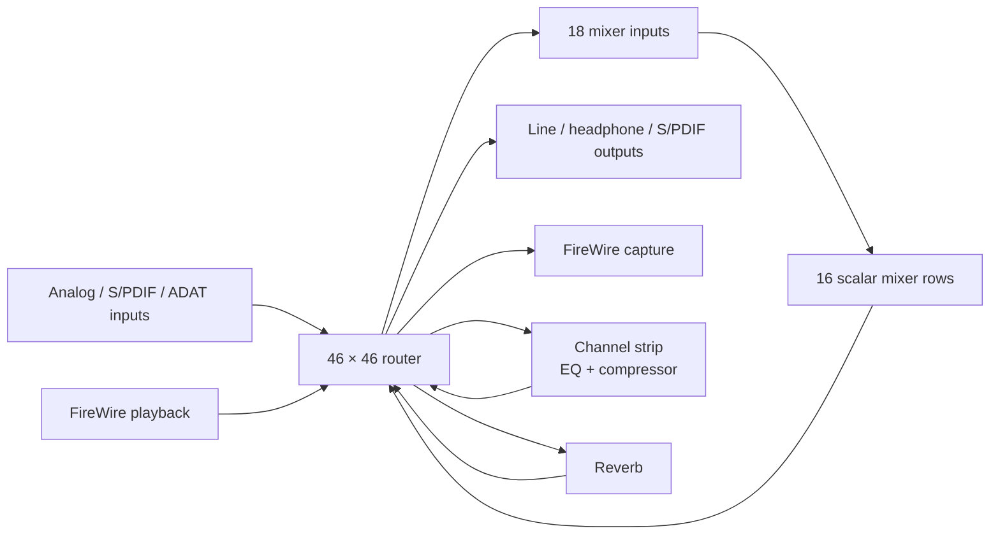
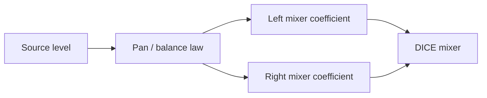
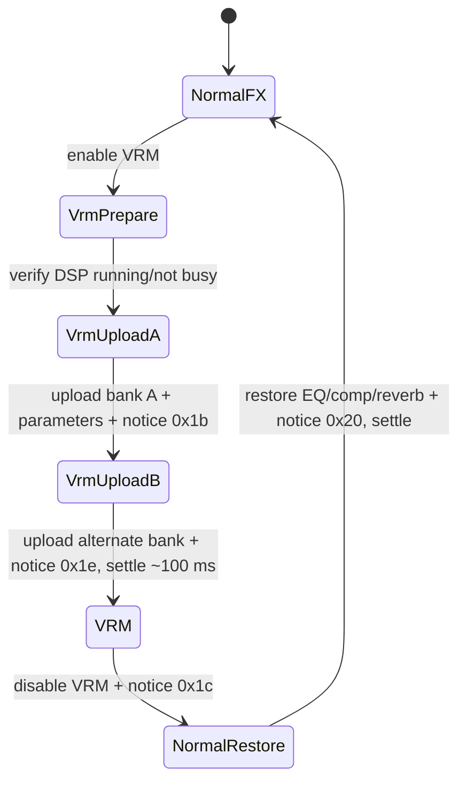

# Focusrite Saffire Pro 24 DSP — Control and DSP Reference

This is the working, device-specific reference for the Focusrite Saffire Pro
24 DSP (`Focusrite 0x00130e`, model `0x000008`).  It records the semantic
model, wire-visible transactions, MixControl behaviour, and implementation
boundaries discovered while bringing the device up in ASFW.

It complements—not replaces—the general audio-semantics documentation and the
DICE stream investigations.  Claims are marked **[measured]** when
observed on this hardware, **[derived]** when recovered from a reference stack
or the vendor binaries and cross-checked, and **[unverified]** when the
behaviour is plausible but still needs a hardware experiment.

## 1. Ground truth and scope

The signal topology and baseline application-section layout are independently
described by ALSA's `snd-firewire-ctl-services` SPro24DSP protocol module:

- `references/alsa-userspace-control-protocols-impl/protocols/dice/src/focusrite/spro24dsp.rs`
- `references/alsa-userspace-control-protocols-impl/runtime/dice/src/focusrite/spro24dsp_model.rs`

The local copy is a behavioral reference only.  It must never be copied into
ASFW: use it to validate addresses, ordering, units, and visible behaviour;
write an independent DriverKit implementation.

The vendor reference is the locally retained `Saffire MixControl` application
and `Saffire.kext`.  Vendor binary analysis supplied the parts ALSA does not
model: natural DSP parameters, stereo-link behaviour, monitor presets,
headphone mirroring, InSitu/VRM choreography, and meter cadence.

ASFW currently has a working DICE stream bring-up and readback-oriented SPro
surface.  This document describes what is safe to expose next; it is not a
claim that every described control is already writable.

## 2. Hardware signal model

At 1x rates the device has a 46×46 router feeding an 18×16 monitor mixer.
The router has physical sources, FireWire playback sources, the sixteen mixer
outputs, channel-strip return, and reverb return.  It also feeds physical,
digital, stream, and mixer-input destinations.



The first four router entries are reserved for physical-input meter sources:
Mic 1, Mic 2, Line 1, Line 2 in that order.  Preserve them when editing router
images; they are not ordinary patchbay slots. **[derived]**

MixControl can present selected mixer outputs as monitor pairs (`MIX 1/2`,
`MIX 3/4`, … `MIX 15/16`). The raw DICE image alone does not prove that every
adjacent pair is one current MixControl bus, or publish its mono/stereo and pan
state. Do not infer this grouping from row adjacency. **[derived]**

## 3. Mixer semantics: why a mono strip is not two faders

The DICE mixer owns two physical coefficients per source and selected stereo
mix destination: left and right.  Those coefficients are the *wire truth* but
not the appropriate primary UI model.

MixControl represents a mono source as one level and one pan control, derives
the left/right coefficients, and supports linking adjacent channel strips.  A
stereo source is represented as linked level plus balance; independent L/R
sends are an advanced/unlinked form.



The mixer coefficient law is unsigned Q2.14 amplitude:

| coefficient | audible value |
|---:|---:|
| `0x0000` | mute / −∞ dBFS |
| `0x4000` | unity / 0 dB |
| `0xffff` | approximately +12 dB |

For a nonzero coefficient, display gain as
`20 × log10(coefficient / 0x4000)`.  Never display it as a percentage.

### Required semantic projection

`AudioSemanticMatrixAxis` now publishes stable presentation group and channel
role metadata, so source channels can be correctly identified as mono or a
verified stereo member. It still intentionally does **not** publish a
MixControl monitor strip from raw output rows: the live image does not reveal
the strip's bus grouping, pan law, or link state.

The next matrix revision needs the remaining presentation metadata, not
SPro-specific SwiftUI guesses:

| field | purpose |
|---|---|
| `groupId` | stable stereo/group identity |
| `channelRole` | mono, left, or right |
| `presentation` | mono-pan, stereo-balance, or independent |
| `linkCapable` / `linked` | whether paired mutation is supported/current |
| `panCapable` | permits a pan/balance projection |

Default console projection:

- Mono sources: one level fader + pan, after the pan law is captured.
- Stereo pairs: one linked fader + balance, after link state is read/writable.
- Raw L/R coefficient editing: never exposed as an ordinary console control.
- Mute is a coefficient macro that must remember pre-mute gains.
- Solo is a multi-crosspoint policy, not a separately readable hardware bit.

### Safe mixer write transaction

A bounded raw mixer crosspoint change is a direct 4-byte mixer write followed
by a readback. It does **not** use a router command or a software notice. This
primitive is deliberately **not** exposed through ASFW's semantic control API:
a single cell lacks an audible MixControl meaning. It is retained for protocol
tests and will underpin the grouped transaction below.

```text
read current coefficient / semantic state
  → derive bounded changed coefficient(s)
  → direct 4-byte DICE mixer write per changed crosspoint
  → read back changed coefficient(s)
  → publish a new matrix revision
```

For a linked pair or a pan change, this remains one semantic transaction even
though it changes two crosspoints.  Failure must leave the app tied to hardware
readback, not the requested value. The current console correctly withholds
mixer faders until that transaction exists.

## 4. Routing and headphone semantics

Router mutation is a different transaction family from mixer mutation:

```text
read full bounded router image
  → change the requested route(s), preserving meter entries
  → write staged router image
  → execute LoadRouter(active rate mode)
  → poll command completion
  → read current-config router image
  → publish the verified patchbay revision
```

Do not place the patchbay in the monitor-mixer row.  It is an upstream source
assignment layer and belongs in its own expandable console section.

### Headphone mirror

MixControl's headphone link is a routing macro, not a mute mode.  When enabled,
it routes both headphone stereo pairs from the selected monitor output pair.
When disabled, it restores the prior per-headphone routes.  The UI should expose
one explicit `Mirror monitor to headphones` policy control and retain the prior
routes in the driver transaction state. **[derived]**

### Optical mode

Optical S/PDIF versus ADAT is also a routing/configuration change, not a single
boolean.  MixControl updates several low- and high-rate routes, disconnecting
incompatible ADAT or S/PDIF endpoints before applying the new mode.  Rate and
optical controls must therefore rebuild the applicable route image and verify
the result before audio restart.

## 5. Physical I/O and monitor control

The driver currently publishes each physical output pair's source as active
router readback. This is separate from output level/mute and from the mixer.
For the captured working configuration, line out 1/2, line out 3/4 / HP1, and
line out 5/6 / HP2 all resolve to `DAW 1/2`; changing a raw mixer coefficient
cannot affect those paths. **[measured]**

The currently known writable physical controls are:

| area | control |
|---|---|
| Inputs 1/2 | Line or Instrument mode |
| Line inputs 3/4 and 5/6 | `+16 dBu` or `−10 dBV` nominal level |
| Outputs 1/2, 3/4, 5/6 | individual level and mute |
| Global | mute and dim |

Output values `0…127` are integer attenuation in dB, not arbitrary logical
units: `0` is 0 dB, `127` is −127 dB/practical mute.  The UI should display the
negative dB attenuation and orient its fader accordingly. **[derived]**

The output group also carries assignments for hardware knob, mute, and dim
controls.  MixControl exposes monitor presets such as Stereo (1/2), Quad
(1/2 + 5/6), 2.1, 5.1, Mid + Phones 1 (3/4), and Mini + Phones 2 (5/6).  These
are output-assignment macros and should become a later semantic monitor-control
surface; they are not mixer routes. **[derived]**

## 6. Ordinary DSP path

The ordinary DSP path contains two channel strips (EQ + compressor) and a
stereo reverb.  Changes are effective only after the appropriate software notice
is written to application-section offset `0x05ec`.

### 6.1 Channel-strip flags

The flags word is at application offset `0x0078`; notice `0x05` applies it.

| bit(s) | meaning |
|---|---|
| 0, 1, 2 | channel 1 EQ enable, compressor enable, EQ-after-compressor |
| 16, 17, 18 | channel 2 equivalent |
| 24 | channel-strip stereo link |

All flag mutations must be read-modify-write and must preserve bits outside the
requested field.  In particular, a serializer which reconstructs just bits
0–2 and 16–18 destroys the vendor stereo-link state.

When enabling stereo link, MixControl mirrors channel 1's order, EQ state,
compressor state, and coefficients to channel 2 before asserting bit 24.
Disabling link restores independent editing; it does not invent a new DSP state.

### 6.2 Coefficient banks and notices

The device uses rate-specific derived DSP banks.  The vendor's active-rate
bank offsets are:

| rate | bank offset | channel blocks |
|---:|---:|---|
| 44.1 kHz | `0x120` | 0/1 |
| 48 kHz | `0x230` | 2/3 |
| 88.2 kHz | `0x340` | 4/5 |
| 96 kHz | `0x450` | 6/7 |

Within a channel block, the relevant fragments are:

| relative offset | size | role |
|---:|---:|---|
| `0x000` | 6 quadlets | compressor |
| `0x018` | 2 quadlets | EQ output |
| `0x020`, `0x034`, `0x048`, `0x05c` | 5 quadlets each | EQ bands |
| `0x070` | 6 quadlets | reverb |

Use only the affected fragments and then the matching notice:

| effect | notices |
|---|---|
| channel-strip flags | `0x05` |
| compressor, individual channels | `0x06`, `0x07` |
| compressor, paired update | `0x08` |
| EQ output / bands, paired update | `0x0b`, `0x0e`, `0x11`, `0x14`, `0x17` |
| reverb | `0x1a` |

An ordinary DSP mutation is always:

```text
read relevant raw flag word and active-rate bank
  → calculate changed coefficient fragment(s)
  → write only those fragment(s)
  → send exact effect notice(s)
  → read back the flag word / affected coefficients
  → publish a new control revision
```

Never serialize sparse controls into a newly zeroed 0x88-byte block and write
the whole block: EQ, compressor, and reverb occupy overlapping logical regions
of the same rate-specific DSP state.

### 6.3 Friendly parameter laws

The following vendor UI mappings have been recovered and are suitable for a
clean-room implementation and test vectors.

#### Compressor

| UI parameter | range | DSP coefficient mapping |
|---|---:|---|
| Input gain | −18…+18 dB | input stage gain |
| Output gain | −36…+36 dB | `10^(dB / 20)` |
| Threshold | −80…0 dB | `dB / 64` |
| Ratio | vendor ratio control | UI value × `0.5` into coefficient domain |
| Attack | 2…100 ms | `−exp(−1 / (sampleRate × seconds))` |
| Release | 100 ms…3 s | `exp(−1 / (sampleRate × seconds))` |

#### Equalizer

There are low, low-mid, high-mid and high bands, generally with ±18 dB gain.
The centre-frequency ranges are approximately 40 Hz…18 kHz depending on the
band.  Low/mid sections use ordinary boost/cut biquad generation; the high shelf
uses a modelled Neve analogue network followed by a bilinear transform.

The user-facing gain/frequency/Q controls should be stored semantically and
derived for the active sample rate.  Do not expose the five raw biquad numbers
as a primary UI.

#### Reverb

| UI parameter | range | mapping |
|---|---:|---|
| Size | 0…100% | direct |
| Air | 0…100% | stored as `1 − UI value` |
| Mix | 0…100% | wet = `mix²`, dry = `1 − mix²` |
| Prefilter | −5…+5 | nonlinear one-pole coefficient |

## 7. InSitu / VRM is a separate subsystem

InSitu/VRM must not be exposed as an ordinary boolean DSP control.  The vendor
transition:



It writes large coefficient banks, room/position/speaker identifiers, checks
DSP busy/running state, uses notices `0x1b`, `0x1c`, `0x1e`, and `0x20`, and
waits approximately 100 ms during transitions.  The vendor coefficient corpus
also needs a licensing/product decision before ASFW redistributes anything.

Until there is a complete bank/data strategy, expose only read-only VRM status.
The existing boolean-plus-notice helper is insufficient and must not back a UI
toggle.

## 8. Metering

MixControl's GUI idle task runs every 20 ms, i.e. approximately 50 Hz.  It
updates mixer meters on each tick. **[derived]**

ASFW meter policy:

- Metering is explicitly opt-in.
- Read at approximately 50 Hz; UI rendering may coalesce frames but should not
  request a full control/matrix snapshot for each tick.
- Publish compact meter frames with a topology/state revision.
- Gate DSP meter reads on `DSP running && !DSP busy`.
- Publish physical input, playback/output, and available FX meter values with
  source identity so the UI never guesses a lane.
- Preserve the four router meter entries described in §2.

## 9. Current ASFW implementation status and hazards

| area | current state | next action |
|---|---|---|
| DICE streaming / stopped choreography | working on tested hardware | retain regression tests |
| Input and output controls | bounded write + readback exists | display output values as dB attenuation; add monitor assignment semantics |
| Semantic mixer snapshot | verified source grouping; read-only reverb-send pair | capture monitor-bus/link/pan semantics, then add grouped writes |
| Patchbay | read-only active assignments | implement router-image transaction |
| DSP control surface | readback published | add ordinary DSP transactions only after RMW/fragment path replaces legacy setters |
| VRM | status only | defer until full bank transition is designed |
| Meters | not published as compact telemetry | add opt-in 50 Hz frames |
| Rate/optical | stream/rate logic exists | model as route + config choreography |

In particular, the generic semantic apply entry currently accepts only physical
input and output IDs.  DSP controls must not be made writable by merely
whitelisting their IDs: they need their distinct state/fragment/notice/readback
transaction family.

## 10. Console layout

The SPro UI should use the same single-page, horizontally scrolling console
language as the M-Audio console—not MixControl's old tabs.

```text
┌ Hardware configuration / clock / optical / stream status ────────────────┐
├ Physical inputs ────────────────┬ Physical outputs / monitor assignment ─┤
├ Monitor mixer (readback boundary until grouped semantics are verified) ───┤
│ [mono level+pan strips] [stereo level+balance strips] … horizontal scroll │
├ DSP: channel strip 1 | channel strip 2 | reverb | VRM status ────────────┤
├ Patchbay: source → destination routes, headphone mirror macro ───────────┤
└ Telemetry: opt-in metering, rate, DSP/state status ──────────────────────┘
```

The mixer, DSP and patchbay are distinct rows because they alter different
hardware layers and have different transaction semantics.  Styling primitives
are shared; routing and mixer state are not.

## 11. Implementation order

1. Capture monitor-bus grouping, channel role/presentation, link state and pan
   law; do not project raw scalar rows into strips before then.
2. Implement bounded grouped level/pan writes with readback, then linked stereo
   semantic mutations.
3. Replace sparse whole-block DSP setters with active-rate, fragment-based
   RMW transactions.  Implement channel-strip stereo link, EQ/compressor
   enable/order, natural compressor parameters, natural reverb parameters,
   then EQ.
4. Add compact opt-in meters at ~50 Hz.
5. Add verified patchbay writes and the headphone-mirror macro.
6. Add monitor assignment presets, then rate/clock/optical configuration
   choreography.
7. Design VRM separately, including coefficient-data licensing and hardware
   validation.

Every writable item is gated by hardware readback.  A UI state is not current
until the device confirms it.

## 12. Linux / ALSA contribution candidates

The useful upstream work is clean-room protocol behaviour and tests, not a
copy of vendor code:

1. Fix the current SPro24DSP reverb write loop: it creates a `0x88`-byte buffer
   but iterates through `0x110` bytes, producing an out-of-bounds slice.
2. Preserve and expose channel-strip stereo-link bit 24.
3. Add documented friendly compressor controls (dB, ratio, ms/s) instead of
   only raw coefficients.
4. Resolve the existing friendly-EQ conversion TODO with independently written
   coefficient generation and test vectors.
5. Add friendly reverb prefilter semantics.
6. Consider FX metering and an explicit headphone-monitor mirror policy.
7. Defer VRM until its alternate banks and coefficient-data provenance are
   settled.

The upstream reference currently models only the per-channel EQ/compressor
flags and raw coefficient-domain controls.  It does not represent the vendor
stereo link, monitor macro semantics, or full VRM transition.

## 13. Hardware validation checklist

- Confirm mono source level/pan produces the expected left/right Q2.14 pair.
- Confirm linked stereo change mirrors the companion DSP and mixer state.
- Exercise each DSP control at 44.1, 48, 88.2 and 96 kHz; verify the active
  bank, notice, readback and audible result.
- Toggle optical ADAT/S/PDIF at each applicable rate and verify both route image
  and stream geometry.
- Toggle headphone mirror, then restore and confirm the original routes return.
- Enable/disable meters while audio runs; confirm no control UI latency or bus
  backlog at 50 Hz.
- Verify VRM remains read-only until a complete implementation exists.
